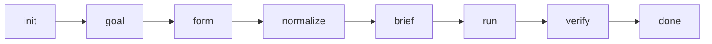
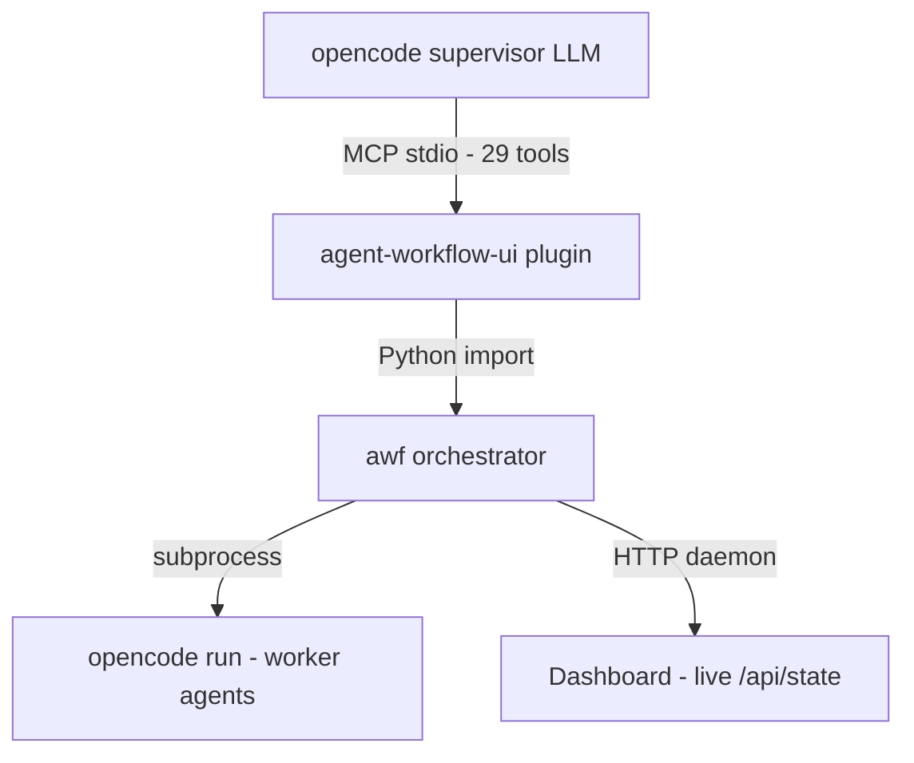

# Agentic Workflow (awf)

[](LICENSE)
[](https://www.python.org/downloads/)
[](https://github.com/EnerJizeIT/agentic-workflow/actions/workflows/test.yml)

> **Multi-agent pipeline orchestrator for opencode. Plan → build → verify → commit — through typed MCP tools, not bash.**

## The problem it solves

AI coding agents are powerful but chaotic. They jump straight to code without planning, skip review, leave bugs. You watch helplessly as tokens burn.

**awf** adds structure: a supervisor agent plans the work, worker agents execute through a pipeline you design (any roles, any depth — from a single worker to a multi-stage chain), and you approve each result before it commits. All through natural language — *"start working on the backlog"*, *"verify and approve"*, *"reject — the DOMParser fix is missing"*.

You stay in control. The agent stays on rails.

## Quick Start

```bash
# 1. Install
pip install -e .
pip install -e ./agent_workflow_ui

# 2. Configure opencode — add to ~/.config/opencode/opencode.json:
# {
#   "mcp": {
#     "agent-workflow-ui": {
#       "type": "local",
#       "command": ["python3", "-m", "agent_workflow_ui"],
#       "enabled": true
#     }
#   }
# }

# 3. Run — just talk to opencode:
# "Initialize awf in my project"
# "Develop the MVP based on the backlog"
```

## Requirements

| Component | Requirement |
|---|---|
| **Python** | 3.10+ |
| **opencode** | any recent version with MCP support |
| **OS** | Linux (tested), macOS (should work), Windows (untested) |
| **Models** | Model-agnostic. Tested with Qwen vLLM. Should work with Claude, GPT, or any opencode-supported provider. |
| **Git** | Required (commit gate, baselines, rollback) |

## Features

- 🎯 **State-Machine Orchestration (SMO)** — awf guides the supervisor through phases: `init → goal → form → normalize → brief → run → verify → done`. Every tool returns a `next_action` hint — even weak models follow the full flow without getting lost.
- 🔧 **29 MCP tools** — typed pipeline control: init, dispatch, start, approve, reject, rollback, dashboard, model validation. No bash, no manual file editing.
- 📊 **Live Dashboard** — HTTP server with real-time polling. Chat-style agent handoffs, TODO content, TODO timeline, worker status, browser notifications. No page reloads.
- 🧱 **Custom pipelines** — any roles, any depth. 1 stage or 10. You choose in the setup form.
- ✅ **Approve / Reject** — symmetric verify tools. Approve commits and archives. Reject kills the pipeline and asks for fixes.
- 🔍 **Pre-dispatch check** — before launching a pipeline, awf greps your codebase for keywords from the TODO. Warning if the task might already be done.
- 🔄 **Crash recovery** — salvage path when workers don't signal, orphan TODO cleanup, state reconciliation on startup.
- 📋 **Increment planning** — decomposition variants (vertical, horizontal, risk-first) presented as an HTML form for user choice.

## Usage

Talk in natural language — the supervisor agent calls the right tools:

| You say | What happens |
|---|---|
| *"Initialize awf in my project"* | Creates `.agentic/`, detects stack, asks for your goal |
| *"Develop the MVP"* | Opens setup form → configures pipeline → plans first TODO |
| *"Verify"* | Supervisor reads handoffs, checks git diff, approves or rejects |
| *"Reject — the cache is missing"* | Pipeline killed, new TODO dispatched with fix instructions |

See [USAGE.md](USAGE.md) for full scenarios and tool reference.

### SMO Flow



| Phase | You do | Supervisor does |
|---|---|---|
| init | — | Creates `.agentic/`, detects stack |
| goal | Answer "what do you want?" | Stores goal |
| form | Fill setup form in browser | Opens form, recommends roles |
| normalize | — | Analyzes role overlaps |
| brief | — | Studies project, dispatches TODO |
| run | Monitor dashboard | **IDLE** — waits for you |
| verify | Say *"verify"* | Reviews, approves/rejects |
| done | "continue" or "stop" | Waits for instruction |

## Architecture



Two packages:
- **`awf`** — Python core. Pipeline engine, phase state machine, signals, commit gate, dashboard server.
- **`agent_workflow_ui`** — MCP plugin. Thin async wrappers + `next_action` guidance + HTML forms.

## Comparison

| | awf | Aider | Claude Code | Devin |
|---|---|---|---|---|
| Planning before code | ✅ | ❌ | ⚠️ | ✅ |
| Human approve/reject | ✅ | ❌ | ❌ | ✅ |
| Custom pipelines | ✅ | ❌ | ❌ | ❌ |
| MCP-native | ✅ | ❌ | ❌ | ❌ |
| Self-hosted / free | ✅ | ✅ | ❌ | ❌ |
| Any LLM provider | ✅ | ✅ | ❌ | ❌ |

## Dashboard

Live HTTP dashboard opens automatically when pipeline starts:

- **Two-panel layout** — pipeline sidebar (stages, progress, worker) + content tabs
- **💬 Agent Chat** — handoffs as conversation messages with chain visualization
- **📝 Задача** — full TODO content in rendered markdown
- **📊 События** — meaningful events, newest first
- **TODO timeline** — `[✅ TODO-0001] ─ [✅ TODO-0002] ─ [🔄 TODO-0003]`
- **Browser notification** when pipeline reaches verify

## Real-world results

6 sessions on jira-epic-presenter (Qwen vLLM):
- Full SMO flow end-to-end: init → goal → form → normalize → brief → run → verify
- 4 TODOs per session, 1× approve (no loops), zero polling
- Reject flow tested: supervisor found missing work, rejected, re-dispatched with fix
- Pre-dispatch check caught already-implemented tasks

## Roadmap

- **SMO escape-hatch'и** — manual phase jumps, interruptions (from real session edge cases)
- **Coverage** — critical paths (verify, plan_checkpoint, context)
- **PyPI** — `pip install awf agent-workflow-ui` (no git clone needed)
- **Dashboard v3** — stage timing bars, session summary, sound notifications
- **Standalone mode** — awf without opencode (API-only)

Full backlog: [BACKLOG.md](BACKLOG.md)

## Documentation

- [USAGE.md](USAGE.md) — usage scenarios and tool reference
- [Architecture](vision/architecture.md) — components, data flow, design decisions
- [Product Vision](vision/agent-ui-plugin.md) — competitive advantages
- [Supervisor Flow (SMO)](vision/supervisor-flow.md) — phase system, next_action pattern
- [CHANGELOG.md](CHANGELOG.md) — version history
- [CONTRIBUTING.md](CONTRIBUTING.md) — how to contribute
- [BACKLOG.md](BACKLOG.md) — open tasks
- [README.ru.md](README.ru.md) — Russian README

## License

MIT — see [LICENSE](LICENSE).
