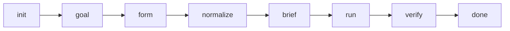
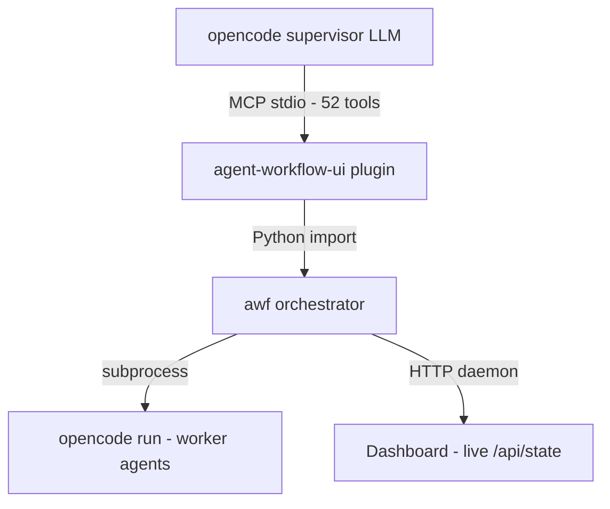

# Agentic Workflow (awf)

[](LICENSE)
[](https://www.python.org/downloads/)
[](https://github.com/EnerJizeIT/agentic-workflow/actions/workflows/test.yml)
[](https://pypi.org/project/awf/)

> **Multi-agent pipeline orchestrator for opencode. Plan → build → verify → commit — through typed MCP tools, not bash.**

## The problem it solves

AI coding agents are powerful but chaotic. They jump straight to code without planning, skip review, leave bugs.

**awf** adds structure: a supervisor agent plans the work, worker agents execute through a pipeline you design (any roles, any depth — from a single worker to a multi-stage chain), and you approve each result before it commits. All through natural language — *"start working on the backlog"*, *"verify and approve"*, *"reject — the DOMParser fix is missing"*.

You stay in control. The agent stays on rails.

## Quick Start

```bash
# 1. Install
pip install awf agent-workflow-ui
# After install the `awf` console command is available (or `python -m awf`)

# 2. Configure opencode — add to ~/.config/opencode/opencode.json:
# {
#   "mcp": {
#     "agent-workflow-ui": {
#       "type": "local",
#       "command": ["python3", "-m", "agent_workflow_ui"],
#       "enabled": true,
#       "timeout": 600000
#     }
#   }
# }

# 3. Run — just talk to opencode:
# "Initialize awf in my project"
# "Develop the MVP based on the backlog"
```

## Requirements

| Component | Requirement |
|---|---|
| **Python** | 3.10+ |
| **opencode** | any recent version with MCP support |
| **OS** | Linux (tested), macOS (should work), Windows (untested) |
| **Models** | Model-agnostic. Tested with Qwen vLLM. Should work with Claude, GPT, or any opencode-supported provider. |
| **Git** | Required (commit gate, baselines, rollback) |

> **Timeouts:** agent stages time out after 1 hour. Extend with
> `AWF_SUPERVISOR_TIMEOUT=7200` (env) or `awf start --timeout 7200`
> (USAGE.md → Troubleshooting).

## Features

- 🎯 **State-Machine Orchestration (SMO)** — awf guides the supervisor through phases: `init → goal → form → normalize → brief → run → verify → done`. Every tool returns a `next_action` hint — even weak models follow the full flow without getting lost.
- 🔧 **52 MCP tools** — typed pipeline control: init, dispatch, start, approve, reject, rollback, dashboard, model validation, run-queue revision, service run. No bash, no manual file editing.
- 📊 **Live Dashboard** — HTTP server with real-time polling. Chat-style agent handoffs, TODO content, TODO timeline, worker status, browser notifications. No page reloads.
- 🧱 **Custom pipelines** — any roles, any depth. 1 stage or 10. You choose in the setup form.
- ✅ **Approve / Reject** — symmetric verify tools. Approve commits and archives. Reject kills the pipeline and asks for fixes.
- 🔍 **Pre-dispatch check** — before launching a pipeline, awf greps your codebase for keywords from the TODO. Warning if the task might already be done.
- 🔄 **Crash recovery** — salvage path when workers don't signal, orphan TODO cleanup, state reconciliation on startup.
- 📋 **Increment planning** — decomposition variants (vertical, horizontal, risk-first) presented as an HTML form for user choice.

## Usage

Talk in natural language — the supervisor agent calls the right tools:

| You say | What happens |
|---|---|
| *"Initialize awf in my project"* | Creates `.agentic/`, detects stack, asks for your goal |
| *"Develop the MVP"* | Opens setup form → configures pipeline → plans first TODO |
| *"Verify"* | Supervisor reads handoffs, checks git diff, approves or rejects |
| *"Reject — the cache is missing"* | Pipeline killed, new TODO dispatched with fix instructions |

See [USAGE.md](USAGE.md) for full scenarios and tool reference.

### SMO Flow


```mermaid
graph LR
    init --> goal --> form --> normalize --> brief --> run --> verify --> done
```

Phase-by-phase: [USAGE.md → SMO phases](USAGE.md#smo-phases).

## Architecture


```mermaid
graph TD
    A[opencode supervisor LLM] -->|MCP stdio - 52 tools| B[agent-workflow-ui plugin]
    B -->|Python import| C[awf orchestrator]
    C -->|subprocess| D[opencode run - worker agents]
    C -->|HTTP daemon| E[Dashboard - live /api/state]
```

Two packages:
- **`awf`** — Python core. Pipeline engine, phase state machine, signals, commit gate, dashboard server.
- **`agent_workflow_ui`** — MCP plugin. Thin async wrappers + `next_action` guidance + HTML forms.

## Comparison

| | awf | Aider | Claude Code | Devin |
|---|---|---|---|---|
| Planning before code | ✅ | ❌ | ⚠️ | ✅ |
| Human approve/reject | ✅ | ❌ | ❌ | ✅ |
| Custom pipelines | ✅ | ❌ | ❌ | ❌ |
| MCP-native | ✅ | ❌ | ❌ | ❌ |
| Self-hosted / free | ✅ | ✅ | ❌ | ❌ |
| Any LLM provider | ✅ | ✅ | ❌ | ❌ |

## Real-world results

This repository is built on awf: a 31-unit stabilization program and the
follow-up verification and documentation waves (13 more units) — plan,
implement, review, verify, commit, with the supervisor approving every unit
and the review stage catching defects before merge.

## Roadmap

- **SMO escape hatches** — manual phase jumps and interruptions (from real session edge cases)
- **PyPI** — `pip install awf agent-workflow-ui`
- **Dashboard v3** — stage timing bars, session summary, sound notifications
- **Standalone mode** — awf without opencode (API-only)

Full backlog: [BACKLOG.md](BACKLOG.md)

## Documentation

- [USAGE.md](USAGE.md) — usage scenarios and tool reference
- [docs/](docs/README.md) — project docs map: design, vision, file bus, contracts, release notes
- [Current audit](docs/audit-2026-09-27-gpt6-sol-xhigh/README.md) — verified fixes and open findings
- [CHANGELOG.md](CHANGELOG.md) — version history
- [CONTRIBUTING.md](CONTRIBUTING.md) — how to contribute
- [BACKLOG.md](BACKLOG.md) — open tasks
- [README.ru.md](README.ru.md) — Russian README

## License

MIT — see [LICENSE](LICENSE).
