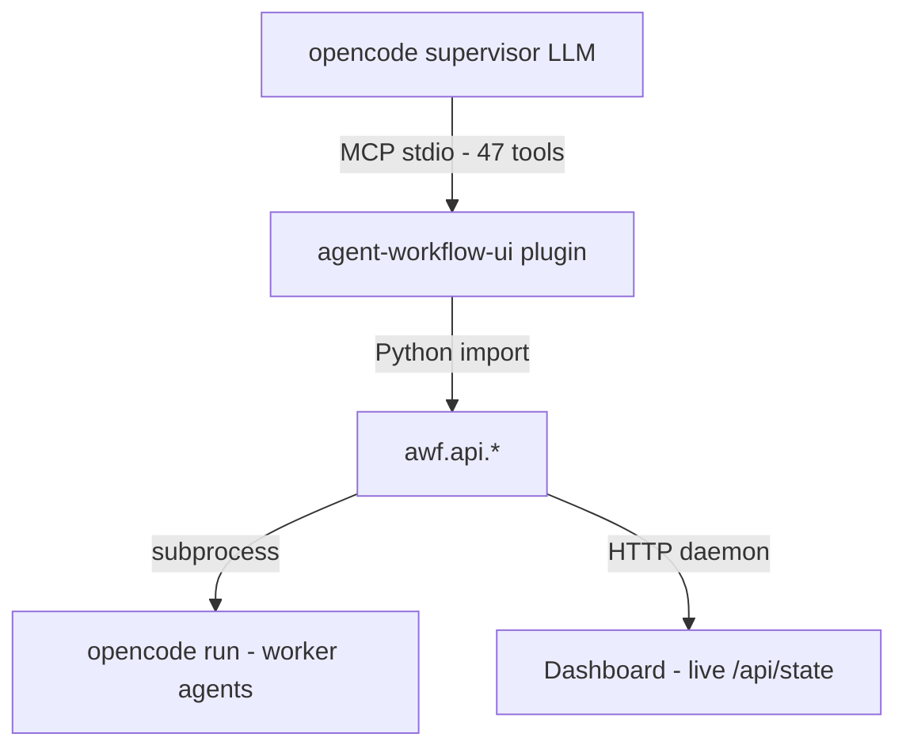

# Архитектура

**Версия:** 3.0 · **Дата:** 2026-09-27 · **Релиз:** 1.4.0

## Обзор

`agent-workflow-ui` — MCP plugin для opencode. 47 typed tools (5 UI + 42 workflow). Plugin импортирует `awf` напрямую (Python import, без subprocess).



## SMO (State-Machine Orchestration)

Awf ведёт supervisor-агента через детерминированные фазы сессии — от init до verify. Supervisor — диалоговый координатор, активный в ключевых точках и пассивный между ними.

### Фазы

```
init → goal → form → normalize → brief → run → verify → done
```

| Фаза | Что делает supervisor | Что делает awf |
|---|---|---|
| **init** | — | Создаёт `.agentic/`, возвращает compact prompt + next_action |
| **goal** | Спрашивает пользователя о цели | `awf_set_goal` → сохраняет goal, advances phase |
| **form** | Рекомендует роли, открывает форму | `apply_project_setup` → materializes pipeline.yaml + config + roles |
| **normalize** | `awf_analyze_roles`, проверяет перекрытия | `awf_confirm_normalized` → advances to brief |
| **brief** | Изучает проект + BACKLOG, pre-check кода, батчит задачи, dispatch | `awf_dispatch_todo` (pre-check grep) → `awf_start` |
| **run** | **IDLE** — ждёт пользователя | Pipeline: agent stages, signal detection, dashboard live |
| **verify** | Читает handoffs + git diff, решает | `awf_approve` / `awf_reject` → commit/replan |
| **done** | Спрашивает пользователя «что дальше?» | State cleared, goal preserved |

Механика фаз:

- `awf/phase.py` — `detect_phase()`, `get_phase_prompt()`, `advance_phase()`; `ALL_PHASES = [init, goal, form, normalize, brief, run, verify, done]`.
- Phase templates: `templates/roles/supervisor/phase-{init,goal,form,normalize,brief,run,verify}.md` + общий `_core.md` (у `done` шаблона нет — фаза терминальная).
- Каждый tool возвращает `next_action` — компактную инструкцию для следующего шага.
- `awf_init` и `awf_load_supervisor_context` возвращают compact phase prompt (не полный supervisor.md).
- Потерянный контекст или новая сессия → `awf_brief` (MCP/CLI): карточка, собранная из живого состояния — фаза, что дальше, run, активные TODO, карта инструментов, ритуалы, recovery-рецепты.

### Забег (run)

Autonomous run (забег) — очередь TODO с механическими гейтами (`awf/api/run.py`, состояние в `.agentic/state/run.yaml`, отдельно от `current.yaml`):

- Запуск: `awf_run_start` (queue, `budget_minutes`, `stop_flags`, `no_checkpoints`), дальше — `awf_run_next` по одному TODO.
- Стоп-условия: очередь пуста, бюджет (в продуктивных минутах) исчерпан, стоп-флаги на следующем TODO, двойной reject одного TODO, предыдущий TODO не завершён.
- Закрытие: `awf_run_finish` → `outbox/RUN-REPORT-{ts}.md`, run помечается inactive.
- Живая строка статуса: `awf_run_note` (видно на дашборде под run-chip).

### Паттерн next_action

Каждый MCP tool возвращает `next_action` — компактную инструкцию:

```
awf_init → "Спроси о цели → awf_set_goal"
awf_set_goal → "Открой форму → awf_open_project_setup_form"
awf_confirm_normalized → "Изучи BACKLOG, вызови awf_dispatch_todo"
awf_dispatch_todo → "Call awf_start(background=True)"
awf_start → "GO IDLE. Do NOT poll. Wait for user."
awf_approve → "APPROVE signal written, evidence stored. Continue the run loop: awf_run_next."
awf_reject → "REVIEW written — the engine replans."
```

### Принципы

- **Детерминизм + LLM.** Awf = рельсы (state machine, signals, handoffs, git, templates, tools). LLM = поезд. Больше детерминизма в рутине → меньше LLM-ошибок → выше качество.
- **Compact prompts.** Phase-specific ~50-100 строк вместо 600-строчного supervisor.md.
- **Batch guidance.** Supervisor батчит BACKLOG задачи в крупные TODO, проверяет код до dispatch. Pre-check grep предупреждает, если паттерн уже в коде.

### Архитектурное решение

SMO распространяет pipeline-state-machine на setup-фазы: awf ведёт весь цикл
сессии (init → goal → form → normalize → brief), не только execute-часть
(plan → agent → agent → verify).

## Компоненты

### awf core

| Файл | Ответственность |
|---|---|
| `api/pipeline.py` | `start_pipeline`, `continue_pipeline`, `kill`, `retry_stage`, `approve`, `reject` |
| `api/run.py` | Забег: `run_start` / `run_status` / `run_next` / `run_finish` / `run_note` |
| `api/_lease.py` | Launch lease `.agentic/logs/awf-launch.lease` (O_EXCL, stale по живости) |
| `api/_liveness.py` | Резолвер живости: PID + проверка argv (защита от PID-реюза) |
| `api/_background.py` | Background-спавн: lease, двойной маркер ребёнка, `automation.runner_dir` |
| `api/dispatch.py` | `dispatch_todo` (atomic: TODO + baseline + signal + pre-check grep) |
| `api/lifecycle.py` | `init_project`, `get_status`, `get_report` |
| `api/setup.py` | `apply_project_setup` (form materialization → pipeline.yaml + config) |
| `api/context.py` | `load_supervisor_context` (aggregate: vision + plan + phase + state) |
| `api/brief.py` | `awf_brief` — карточка супервизора из живого состояния |
| `api/dashboard.py` | Dashboard HTML generation + `generate_state_dict()` JSON API |
| `api/dashboard_server.py` | HTTP server (ThreadingHTTPServer, live polling) |
| `api/model_check.py` | Валидация моделей config.yaml против opencode.json |
| `api/wait_event.py` | `wait_for_event` (supervisor wake-up, chunked sleep) |
| `api/hygiene.py` | `reset`, `restore`, `unblock`, todo remove/retire/update |
| `run_state.py` | `.agentic/state/run.yaml`: лок read→merge→write, shape-проверка (AUD02-06) |
| `pipeline_state.py` | `.agentic/state/current.yaml` persistence |
| `orchestrator.py` | Pipeline dispatch loop (thin entry: setup → stage loop → complete) |
| `pipeline_engine.py` | Stage handlers + transition logic |
| `supervisor.py` | Supervisor prompts (`build_prompt`), signal wait, run-гейты |
| `agent_stage.py` | Worker spawn (`opencode run`), `collect_handoff()` |
| `phase.py` | SMO: `detect_phase`, `get_phase_prompt`, `advance_phase` |
| `brief.py` | Данные brief-карточки (`data/*.yaml`: tool_map, scenarios, recovery) |
| `signal_watch.py` | File-based signal detection (`run_subprocess_until_signal`) |
| `signals.py` | Signal classification, file detection, expected prefixes |
| `transitions.py` | Signal → action resolution (`resolve_transition`) |
| `todos.py` | TODO lifecycle: archive, restore, retire, reconcile |
| `todo_ids.py` | Единственный парсер TODO-ID (4+ цифры, явная правая граница) |
| `unit_contract.py` | Контракт юнита: блок `verify/gates/prove_red` в TODO + `DONE.json` |
| `commit_plan.py` | Commit-план: файлы vs baseline, verdict, чтение `VERIFIED-{id}.sha` |
| `commit_gate.py` | Auto-commit изолированным `GIT_INDEX_FILE` (индекс пользователя не трогаем) |
| `verify.py` | Test/lint execution, auto-DONE synthesis |
| `verify_pack.py` | Verify-отчёт `GATES-{todo}.md` (U5): гейты, diff-минимальность, facts |
| `prove_red.py` | Prove-red в temp-worktree на baseline (U4) |
| `plan_checkpoint.py` | BD-36 checkpoint: one-shot HTTP-форма + одноразовый токен (A-03) |
| `plan_progress.py` | Прогресс плана по стадиям |
| `metrics.py` | Метрики программы (U8): сессии, юниты, строки, стоимость |
| `mutations.py` | Mutation smoke (U11): `FILE @@ FIND @@ REPL @@ CMD` |
| `doctrine.py` | Доктрина проекта: `.agentic/doctrine/*.md` в промт каждой роли (U9) |
| `feedback.py` | Отчёт о трении awf владельцу (RUN4 #2) |
| `include_untracked.py` | Включение pre-existing untracked в коммит юнита (RUN10 #4) |
| `reject_files.py` | REJECT-файлы: списки untracked для carry-over |
| `todo_draft.py` | Черновики TODO для супервизора |
| `opencode_agents.py` | Discovery агентов opencode |
| `config.py` | Чтение `.agentic/config.yaml` |
| `paths.py` | Пути `.agentic/` |
| `git_utils.py` | Git-операции: tree fingerprint (`awf tree-sha`), diff, reset |
| `_proc.py` | `kill_process_tree` (guard `proc.pid > 1` — safety invariant) |
| `_env.py` | Worker-окружение: `OPENCODE_CONFIG_CONTENT`, `automation.readonly_roles` |
| `_atomic.py`, `_lock.py` | Атомарные записи, file lock (read→merge→write) |
| `cli.py`, `cmd_*.py` | CLI: `awf start`, `awf baseline`, `awf brief`, `awf metrics`, ... |
| `pipeline.py` | Разбор пайплайна: Stage, load_stages, kind по позиции (BD-29), валидация YAML (A-06) |
| `api/pipelines.py` | Named pipelines: write_pipeline / list_pipelines (RUN3 #1) |
| `api/planning.py` | Increment planning: apply_increment_plan (форма → вариант) |
| `api/roles.py` | Роли: add_role + zone-анализ для analyze_roles |
| `xdg.py` | XDG config dir (~/.config, XDG_CONFIG_HOME) |
| `_log.py`, `_log_reader.py` | Файловый логгер + чтение логов orchestrator |
| `_names.py` | Уникальные имена при архивации (reserve_base) |
| `_net.py` | Network-хелперы: preflight endpoint, классификация сбоев (U6a) |
| `_errors.py` | Типы ошибок awf |
| `__main__.py` | Entry point `python -m awf` |
| `api/_results.py` | Result-датаклассы awf.api (as_dict для MCP) |
| `api/_errors.py`, `api/_helpers.py`, `api/_stack.py`, `api/_templates.py` | Внутренние хелперы API |

### agent_workflow_ui plugin

| Файл | Ответственность |
|---|---|
| `tools/registry.py` | **Единый реестр** `registry.TOOLS` — единственный источник списка для server, skill и тестов (47 = 5 UI + 42 workflow, R-06) |
| `server.py` | MCP server (stdio transport); регистрирует tools из `registry.TOOLS` |
| `tools/awf.py` | 42 awf tool wrappers (async → `asyncio.to_thread` + `next_action`) |
| `tools/forms.py` | 5 UI tool wrappers (open_form, read_submit, ...) |
| `tools/templates.py` | Реестр HTML-форм |
| `http_endpoint.py` | Long-lived HTTP server для form submits (127.0.0.1, CSRF check) |
| `opencode_config.py` | Model discovery (opencode CLI + opencode.json + opencode.db) |
| `roles_processor.py` | Role setup: form data → `awf.api.apply_project_setup` |
| `state.py` | Form state persistence (YAML + submitting TTL recovery) |
| `agents_md.py`, `skill_installer.py` | Установка AGENTS.md-инструкций и skill `awf-supervisor` |
| `render/` | Template engine (Jinja2 + frontmatter) |

## Pipeline flow

```
1. awf_dispatch_todo → inbox/TODO-NNNN.ready + BASELINE + pre-check grep
2. awf_start(background=True) → lease + orchestrator subprocess + dashboard HTTP server
3. Stage loop:
   a. plan (supervisor) → находит TODO, checkpoint-гейт (one-shot токен)
   b. agent stages → opencode run → DONE/BLOCKED signal
   c. verify (supervisor) → awf_verify_pack → awf_approve (evidence, verified-sha) / awf_reject
4. Commit gate: изолированный index, diff vs baseline → archive → done/
5. В забеге: awf_run_next → следующий TODO из очереди (или стоп по гейту)
```

## Один владелец запуска

Одновременные вызовы запуска (`awf_start` / `awf_run_next`, CLI `awf start` / `awf continue`) дают ровно один выполняющийся пайплайн.

- **Lease:** `.agentic/logs/awf-launch.lease` — O_EXCL, stale определяется по живости процесса, не по возрасту файла (`api/_lease.py`). Прочие вызовы получают `run_mode="noop"` с текстом — не исключение.
- **Резолвер живости:** PID из state проверяется по argv — совпадение «это наш orchestrator» (защита от PID-реюза), одинаково для foreground и background (`api/_liveness.py`).
- **Background-ребёнок — двойной маркер:** env `AWF_BACKGROUND_CHILD=1` + свой argv (`python -m awf start/continue ...`), чтобы резолвер живости и kill находили именно ребёнка (`api/_background.py`).

## Verify-гейты

- **Evidence-гейт (AUD11-03):** в активном забеге `awf_approve` требует `evidence=` — независимая проверка пишется в `.agentic/context/RUN-EVIDENCE-{todo}.md`. Bare ACK/APPROVE без RUN-EVIDENCE игнорируется; вне забега file-based ACK — обычный интерактивный поток.
- **Verified-sha (U11):** `awf_approve(verified_sha=...)` — fingerprint рабочего дерева на момент verify сохраняется в `.agentic/context/VERIFIED-{todo}.sha`; если дерево сдвинулось (коммит, правка файла, новый untracked) — approve отклоняется.
- **Изолированный коммит:** commit gate строит commit на одноразовом `GIT_INDEX_FILE` от HEAD + diff vs baseline (`commit_gate.py`); индекс пользователя не меняется.
- **One-shot токен чекпоинта (A-03):** форма BD-36 привязывается одноразовым токеном (`secrets.token_urlsafe`) — решение относится к этой открытой форме, не к случайному POST.

## Dashboard

HTTP server (daemon thread in orchestrator, `127.0.0.1`):

- `GET /` → HTML dashboard (Jinja2 + embedded initial state JSON)
- `GET /api/state` → JSON со всем пайплайном (stages, handoffs, TODO, worker, events)
- JS polls `/api/state` каждые 3 с (`POLL_INTERVAL_MS = 3000`, `awf/templates/dashboard.html.j2`), патчит DOM — без перезагрузки страницы
- Two-panel: pipeline sidebar + content tabs (chat handoffs / TODO content / events)
- TODO timeline: `[✅ TODO-0001] ─ [🔄 TODO-0002]`
- Browser notification on verify

## State management

- `.agentic/state/current.yaml` — structured pipeline state (stage, todo, PID, phase)
- `.agentic/state/run.yaml` — автономный забег (очередь, позиция, бюджет, rejects) — отдельный файл, свой лок
- `.agentic/state/last-kill.json` — запись последнего kill (orphan-предупреждение на следующем запуске)
- `.agentic/state/metrics_models_cache.json` — кэш цен моделей для `awf metrics`
- `.agentic/state/dashboard_port` — порт HTTP-сервера (отдельный файл)
- `.agentic/logs/awf-launch.lease` — lease одного владельца запуска
- `.agentic/inbox/` — TODO files + signals (ACK, APPROVE, SALVAGE)
- `.agentic/outbox/` — worker signals (DONE, BLOCKED, REVIEW, RUN-REPORT)
- `.agentic/context/` — baselines + CHECKPOINT-{todo}.json + RUN-EVIDENCE-{todo}.md + VERIFIED-{todo}.sha
- `.agentic/handoff/` — per-stage handoff files
- `.agentic/done/{todo_id}/` — archived TODOs (после verify approve)

## Key design decisions

1. **SMO (State-Machine Orchestration).** Awf ведёт supervisor по фазам, LLM исполняет шаги. Compact prompt + next_action на каждом шаге.
2. **next_action в каждом tool.** Даже слабые модели следуют короткой инструкции из tool result.
3. **File-based signal bus.** Workers communicate via files, not IPC. Simple, debuggable.
4. **HTTP dashboard.** Live polling через /api/state — без page reload, без file:// CORS.
5. **Pre-dispatch check.** `dispatch_todo` greps codebase для identifiers из TODO — warning если уже реализовано.
6. **TODO rollback.** Если baseline fail → TODO .md удаляется (нет orphan TODOs).
7. **PR_SET_PDEATHSIG.** Worker subprocesses die with orchestrator (Linux).
8. **Закреплённый движок (`automation.runner_dir`).** Для проектов, где awf правит сам себя: background-ребёнок стартует с cwd закреплённого checkout — движок берётся оттуда, а не из дерева проекта, которое воркер меняет прямо сейчас (TODO-0077).
9. **Evidence-гейт (AUD11-03).** В забеге approve без записи RUN-EVIDENCE не принимается, а ручной ACK без неё игнорируется. Содержимое evidence сообщает вызывающий; фактический запуск проверок ядро не удостоверяет.
10. **Единый реестр tools (R-06).** `tools/registry.py` — один список для server, skill-установщика и тестов: 47 tools не расходятся по файлам.
11. **`readonly_roles` (W7).** Роли из `automation.readonly_roles` не получают новых `edit/write` override в `OPENCODE_CONFIG_CONTENT`. Это не запрет записи: прежние разрешения пользователя сохраняются, а `bash` остаётся разрешённым. Ограничение роли пока держится на инструкции и конфигурации хоста.
12. **Mutation smoke (U11).** `awf mutations` — supervisor проверяет, что ключевые инварианты реально ловятся тестами: подменить строку в файле, прогнать команду, ожидание красного.
13. **Salvage-сценарий.** Worker умер без сигнала → `SALVAGE-{todo}.md` + рестарт стадии (`awf_retry_stage`); сценарий зафиксирован в brief-карточке (`awf/data/scenarios.yaml`) и в recovery-разделе USAGE.

## Связанные документы

- [Product Vision](vision.md)
- [File Bus Protocol](file-bus.md)
- [BACKLOG](../BACKLOG.md)
