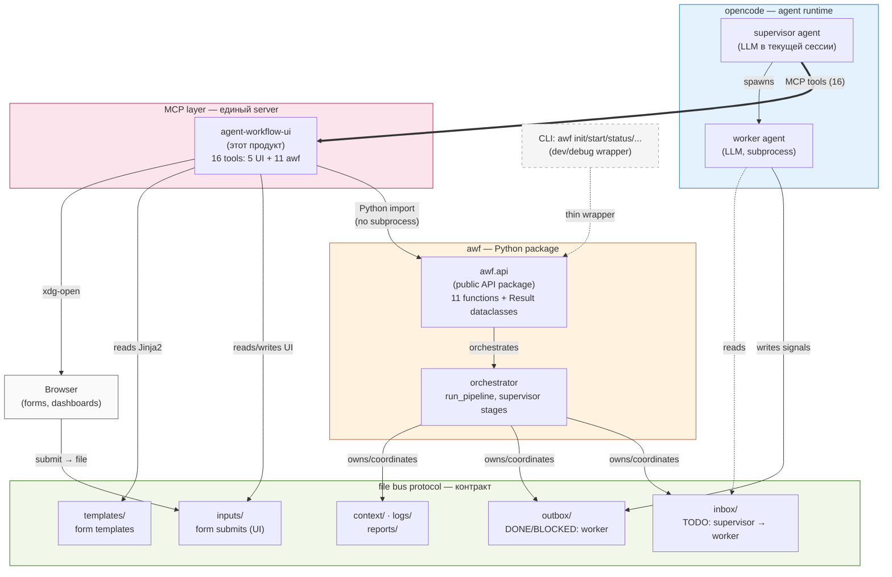

# agent-workflow-ui — Product Vision

> **awf's MCP plugin** — единый MCP-сервер с UI-инструментами (HTML-формы, дашборды) **и** workflow-операциями (init, start, status, rollback, ...). Работает только с awf как orchestrator. Plugin зависит от `awf` Python-пакета и импортирует `awf.api` напрямую (без subprocess). **MCP primary path** — opencode-агент вызывает `awf_init`/`awf_status`/... как typed MCP tools; CLI `awf` сохранён как тонкая dev/debug обёртка.

> **Pivot v0.5 (2026-08-01):** в v0.4 фиксулировалось «CLI primary, standalone UI product, agnostic к awf, 2 отдельных MCP server'а». После dogfood'а выяснилось: это создавало дублирование (две точки входа для одного workflow) и сложность для агента (multiple tools across multiple servers). Принято архитектурное решение: **объединить UI + workflow ops в один plugin, MCP primary, plugin зависит от awf**. Generality (другие orchestrators) — отложена до появления реального второго orchestrator'а (см. §11).

## 1. Что это и границы продукта

### 1.1 Что это

**agent-workflow-ui** — MCP plugin для opencode, реализованный как Python-пакет + Skill markdown. Даёт агенту (supervisor'у) **16 typed MCP tools**:

1. **UI tools (5):** `open_form`, `read_submit`, `cancel_form`, `list_pending_forms`, `list_templates`. Генерация/чтение HTML-форм для структурированного ввода от пользователя.
2. **awf workflow tools (11):** `awf_init`, `awf_status`, `awf_start`, `awf_continue`, `awf_baseline`, `awf_rollback`, `awf_approve`, `awf_report`, `awf_reset`, `awf_add_role`, `awf_analyze_roles`. Полный lifecycle управления awf-проектом — без shell-команд.

Plugin = **primary interface** между агентом и awf-orchestrator'ом. CLI `awf` остаётся как thin dev/debug wrapper (CI, e2e тесты, ad-hoc inspection).

### 1.2 Границы продукта (scope)

**agent-workflow-ui — это plugin для awf.** Не standalone UI product (было в v0.4). Plugin работает только с awf; зависит от `awf` Python-пакета.

| Что в scope | Что НЕ в scope |
|---|---|
| MCP server с UI + workflow tools (всего 16) | Альтернативные orchestrators (поддержка отложена до §11) |
| Jinja2-шаблоны форм и дашбордов | Хранение ролей/скиллов (это orchestrator через `awf_add_role`) |
| Skill markdown с UI-политиками | LLM-агенты (живут в opencode, не в plugin) |
| File-based submit ingestion (`inputs/`) | Worker execution (это `awf_start` делегирует в orchestrator) |
| Thin wrappers над `awf.api.*` (без business logic в plugin) | Дублирование logic между CLI и MCP tools (один источник — `awf.api`) |

**Plugin зависит от awf.** `agent_workflow_ui/pyproject.toml: dependencies += ["awf>=0.4.0"]`. Все 11 workflow tools — thin async wrappers, вызывающие `awf.api.<function>()` напрямую (Python import, не subprocess).

### 1.3 Архитектурный принцип

**Tight coupling внутри monorepo, через public API**:
- `awf.api` — single source of truth для workflow logic (init/status/start/baseline/...).
- `agent-workflow-ui` plugin — thin wrappers: UI tools (form lifecycle) + workflow tools (delegates to `awf.api`).
- MCP protocol — единственная точка входа для opencode-агента.
- CLI `awf` — third thin wrapper over `awf.api` (для dev/debug).

Это позволяет:
- Одно поведение для CLI и MCP (один source of truth, нет diverging semantics).
- Typed contract между агентом и awf (MCP tool signatures).
- Минимальную сложность для агента (всё в одном plugin'е, не переключается между servers).

## 2. Целевая аудитория

**Developer и PM** (не junior).

- **Developer** — хочет автоматизировать агентскую рутину, но сохранить контроль над стратегическими решениями. Уверен в CLI, opencode, готов настраивать plugin'ы. Может использовать любой orchestrator с file bus протоколом.
- **PM** — хочет видеть прогресс и принимать продуктовые решения без погружения в код. Формы дают точечный interface для влияния без необходимости знать синтаксис команд.

**Не наш user:** junior, не способный поставить opencode + plugin. Мы не оптимизируемся для этой аудитории.

## 3. Проблема

В существующем (pre-pivot) workflow:

1. **Структурированные вводы неэффективны.** Выбор из 10 фич с приоритетами через chat — долгое печатание, error-prone, сложно вернуться назад. Согласование стека, моделей, ролей — требует многих сообщений туда-сюда.
2. **Visibility для long-running pipeline плохая.** Нужно держать терминал открытым, либо постоянно опрашивать `awf status`. Worker работает 30 минут — пользователь не видит, что происходит внутри.
3. **Onboarding трудный.** Пользователь ставит awf, не знает какие команды запускать, какие опции выбирать. README помогает, но всё равно — это порог.
4. **Контекст loss между сессиями.** Возврат к проекту через неделю требует перечитывания chat-истории. Дашборд с актуальным состоянием — лучше.
5. **Двойной интерфейс (CLI + MCP) — operability problem.** Pre-pivot: агент должен знать, когда использовать CLI (bash), когда — UI tools. Это создавало diverging behavior, race conditions (например `_run_in_background` в CLI vs `_start_in_background` в api — см. историю багфиксов). **Единый MCP primary path** устраняет двойную точку входа.

## 4. Решение — принцип

Три типа интерфейсов, каждый — в своей сильной стороне:

| Medium | Сильная сторона | Когда неэффективен |
|---|---|---|
| **Chat (в opencode)** | Dialogue, tone calibration, итеративные уточнения, простые Y/N | Структурированные решения, файловые выборы, визуализация прогресса |
| **HTML-формы (MCP `open_form`)** | Структурированный ввод, multi-select, dropdowns, file picker, drag-and-drop | Простые Y/N, dialogue, итеративные уточнения |
| **HTML дашборд** | Прогресс pipeline, история сигналов, мониторинг | Dialogue, принятие решений |

**MCP tools primary path:** agent вызывает `awf_*` tools напрямую через MCP protocol. CLI `awf` — для dev/debug/CI, не для основного взаимодействия.

**Эвристика «когда форма» (по умолчанию — chat):**

| Ситуация | Medium |
|---|---|
| Y/N ответ | Chat |
| Выбор из 2 вариантов с короткими описаниями | Chat |
| «Выбор из ≥4 опций с descriptions и costs» | Форма |
| «Какие модели для 3 ролей?» (nested choices) | Форма |
| «Приоритеты 10 фич» | Форма |
| «Загрузи product-vision файл» | Форма (file picker) |
| Архитектурное решение (irreversible / expensive) | Форма |
| Тактическое уточнение в работе | Chat |
| Long-running pipeline — посмотреть что происходит | Дашборд |

**Принцип:** chat по умолчанию, форма когда chat-ответ потребует долгого печатания или сложной структуры. Дашборд — для monitoring, не для decisions.

## 5. Принципы и ограничения

### Принципы

1. **MCP primary.** Agent вызывает typed MCP tools (`awf_init`, `awf_status`, `open_form`, ...). CLI `awf` — dev/debug/CI обёртка, не основной path.
2. **HTML — точечный инструмент.** Не replacement chat, а supplement там, где chat ломается (структурированные вводы, multi-select).
3. **Форма — это contract.** И supervisor, и пользователь знают схему: что ожидается, какие поля, какой формат ответа.
4. **Async submit.** Form submit создаёт signal (`.agentic/inputs/<form_id>.yaml`), supervisor читает когда готов. Pipeline может ожидать signal — supervisor (LLM) не расходует токены в ожидании.
5. **Шаблоны — agent-driven.** Plugin ships с default templates (внутри пакета). Project-level templates в `.agentic/templates/` могут override'нуть default по имени, **но пользователь не кладёт их туда вручную** — только агент (LLM) может создать template: пишет front (`.html.j2`) и описывает в SKILL.md / supervisor.md как интерпретировать submit (back).
6. **Plugin реализован как MCP server + Skill markdown.** MCP даёт typed tools. Skill markdown даёт LLM-readable policy (когда/как использовать). Awf делегируется через `awf.api` import.
7. **Plugin зависит от awf.** `pyproject.toml: dependencies += ["awf>=0.4.0"]`. Все `awf_*` tools — thin async wrappers над `awf.api.*()` синхронными функциями. Business logic живёт в awf, не в plugin'е.

### Ограничения (что НЕ делаем)

1. **Не SPA.** Никакого React/Vue/сборщиков. Static HTML + minimal JS.
2. **Не WebSocket.** Дашборд обновляется через meta-refresh.
3. **Не mobile-first.** Desktop browser.
4. **Не real-time collaboration.** Один пользователь — одна сессия. Multi-user — далёкий backlog.
5. **Не для junior.** Требует CLI/opencode компетенций.
6. **Не заменяет chat полностью.** Если форма не подходит — fallback на chat.
7. **Не делает architectural решений за пользователя.** Plugin предоставляет interface, не заменяет judgement.
8. **Не поддерживает Python < 3.10.** Зависимость `mcp>=1.0` требует Python ≥3.10. Это сознательное ограничение, не баг.

## 6. Пользовательские сценарии

Сценарии перечислены в порядке приоритета MVP (от первого к последнему).

### Сценарий 1 (MVP — Priority 1) · Конструктор конфигурации

**Контекст:** пользователь начинает новый проект или хочет перенастроить существующий. Нужно сконфигурировать orchestrator (awf по умолчанию): роли, скиллы, модели, pipeline.

**Шаги:**
1. Пользователь в CLI: «хочу начать новый проект» (или «хочу перенастроить конфигурацию»).
2. Supervisor: «Я открыл конструктор конфигурации в браузере».
3. В браузере — **composite-форма `project-setup`** (одна страница, три секции):
   - **Контекст:** textarea для описания проекта + file picker для прикрепления ТЗ (`.md`/`.txt`, можно несколько файлов — содержимое отправляется агенту).
   - **Supervisor:** dropdown (Default + сохранённые кастомные варианты `.md`), опционально загрузка своего `.md` с галочкой «сохранить для будущих сессий». Инструкции **дополняют** default supervisor.md, не заменяют.
   - **Команда агентов:** добавление строк `[agent + model]`. Agent = выбор из дефолтных ролей или из сохранённых кастомных, либо inline-создание своего (имя + загрузка `.md` скилла + галочка «сохранить» 💾). Model = dropdown из opencode, сгруппированный: `<optgroup label="Recent">` (из истории сессий) + `<optgroup label="All models">` (полный список).
   - **Pipeline:** явно НЕ выбирается. Определяется **гибко через состав команды** — supervisor (LLM) выводит структуру pipeline из выбранного пула агентов и контекста проекта.
4. **Конфликт-резолюция (inline):** если пользователь сохраняет кастомную роль (agent или supervisor variant) с именем, совпадающим с уже существующим файлом в `~/.config/awf/roles/`, форма показывает JS `confirm()` диалог **до отправки submit**: «Перезаписать существующую роль X?». Подтверждение → перезапись; отмена → пользователь меняет имя или отписывается от сохранения. Никаких отдельных мини-форм.
5. Пользователь заполняет основную форму, нажимает **Submit**.
6. **Plugin** только принимает submit и сохраняет кастомные `.md` (если были галочки «сохранить») в `~/.config/awf/roles/`. **Генерация `.agentic/config.yaml`, директорий `roles/`, `pipelines/`, `.gitignore` — ответственность supervisor (LLM)**, не plugin'а. Plugin остаётся agnostic к internals awf. Supervisor в CLI: «Готово. Конфигурация сохранена. Что дальше?».

**Ценность:** снижает cognitive load при setup; ошибка в конфигурации (забытая роль, неверная модель) исключена — форма валидирует. Кастомные роли/скиллы подгружаются без ручного копирования файлов.

**Сложность:** средняя (одна composite-форма + inline conflict resolution через JS confirm).

**Связанный шаблон:** `project-setup.html.j2` (composite). Остальные отдельные templates (`role-assignment`, `skill-picker`, `model-picker`, `pipeline-picker`, `conflict-resolver`) зарезервированы для будущих сценариев (wizard в Сценарии 6, ad-hoc forms в Сценарии 2-3).

---

### Сценарий 1.1 · MVP features (вне базового сценария, реализовано)

В ходе итеративной разработки composite-формы добавлены следующие features, не предусмотренные первоначальным сценарием, но доказавшие полезность:

| Feature | Где | Зачем |
|---|---|---|
| **Spec files upload** (ТЗ) | Секция «Контекст», file picker multiple `.md`/`.txt` | Передать supervisor'у дополнительный контекст: product vision, бэклог, требования. Содержимое идёт в submit JSON, агент парсит сам. |
| **Recent models grouping** | Dropdown моделей, `<optgroup label="Recent">` сверху | Сужает выбор: последние использованные модели (из opencode SQLite history) — обычно то, что нужно. Полный список ниже под `<optgroup label="All models">`. |
| **Inline delete 🗑** | В dropdown сохранённых ролей/supervisor variants | Управление библиотекой кастомных ролей прямо из формы — без файлового менеджера. Confirm → при submit роль удаляется с диска. |
| **Supervisor variants как отдельный concept** | Секция Supervisor, dropdown с custom `.md` | Default supervisor.md — universal. Custom variants (`supervisor-architect.md`, `supervisor-ml-engineer.md`) — ДОПОЛНЯЮТ default, узкоспециализированные инструкции. Хранятся в `~/.config/awf/roles/supervisor-*.md`. |
| **Save checkbox 💾 для custom agents** | Inline custom agent row, default checked | Решение пользователя — сохранить новый агент в библиотеку для будущих проектов, или использовать только в этой сессии. Чекбокс виден прямо в строке команды. |

---

### Сценарий 2 (Priority 2) · Decision fork в работе

**Контекст:** идёт итерация разработки. Worker упирается в архитектурную развилку — выбор библиотеки, паттерна, протокола.

**Шаги:**
1. Supervisor в CLI: «Worker упирается в выбор БД (PostgreSQL vs MongoDB vs SQLite). Я открыл форму с сравнением».
2. В браузере: decision-tree форма. 2-3 опции с описаниями, pros/cons таблицей, cost estimates, risk levels.
3. Пользователь выбирает опцию, опционально добавляет комментарий в textarea, нажимает **Submit**.
4. Supervisor: читает submit, формирует новый TODO с выбранным направлением, передаёт worker'у.

**Ценность:** структурированные архитектурные решения вместо длинных chat-обсуждений. Решение сохраняется в файле — становится частью истории проекта.

**Сложность:** низкая.

**Связанные шаблоны:** `decision-tree.html.j2`, `architecture-choice.html.j2`.

---

### Сценарий 3 (Priority 3) · Blockage recovery

**Контекст:** worker BLOCKED с описанием проблемы и N вариантами решения.

**Шаги:**
1. Supervisor в CLI: «Worker заблокирован на задаче X. Я открыл форму с вариантами решения».
2. В браузере: форма с:
   - Описание проблемы (markdown rendered).
   - Варианты решения (radio + описание каждого, risk/cost/effort).
   - Textarea для комментария/уточнения.
3. Пользователь выбирает опцию, пишет комментарий, **Submit**.
4. Supervisor: формирует исправленный TODO с учётом выбора, запускает worker.

**Ценность:** структурированная обработка проблем вместо «эскалации в chat, которая тонет в истории».

**Сложность:** средняя.

**Связанные шаблоны:** `blockage-recovery.html.j2`.

---

### Сценарий 4 (Priority 4) · Long-running pipeline monitoring

**Контекст:** `awf start --background` запущен на долгую задачу (часы).

**Шаги:**
1. Supervisor: «Pipeline запущен. Dashboard открыт в браузере».
2. В браузере: статичный HTML, meta-refresh каждые 10 секунд. Содержит:
   - Текущая стадия pipeline.
   - Прогресс worker'а (по `PROGRESS-*.md`).
   - Последние сигналы (DONE / BLOCKED / REVIEW-…).
   - Хвост лога оркестратора.
   - Git status (изменённые файлы).
3. Pipeline финиширует. Dashboard: «Готово. Вернись в CLI для verify».
4. В CLI: пользователь делает verify.

**Ценность:** transparency для долгих задач; пользователь может переключаться на другие задачи, зная что pipeline «на виду».

**Сложность:** средняя (static rendering + meta-refresh, без real-time).

**Связанные шаблоны:** `dashboard.html.j2` (статичный, заполняется данными).

---

### Сценарий 5 (Priority 5) · Priority planning session

**Контекст:** пользователь хочет спланировать roadmap или приоритизировать backlog.

**Шаги:**
1. В CLI: «хочу спланировать Q1» / «расставь приоритеты по 10 фичам».
2. Supervisor: «Я открыл priority-matrix. Перетащи фичи в нужном порядке».
3. В браузере: drag-and-drop priority list. Список фич берётся из product-vision файла или из backlog'а пользователя.
4. Пользователь расставляет, опционально помечает «must-have» / «nice-to-have», **Submit**.
5. Supervisor: читает приоритеты, генерирует N TODO (по одному на top-priority фичу), формирует pipeline, запускает.

**Ценность:** сложный ввод без typing; визуальная приоритизация лучше текстовой.

**Сложность:** высокая (drag-and-drop UI).

**Связанные шаблоны:** `priority-matrix.html.j2`.

---

### Сценарий 6 (Priority 6) · Onboarding wizard

**Контекст:** пользователь начинает с нуля, ничего не знает про awf. Хочет «просто сделать проект».

**Шаги:**
1. В CLI пользователь пишет «хочу сделать интернет-магазин» — без знания команд.
2. Supervisor открывает **первую форму**: тип проекта (web / API / mobile / desktop / ML).
3. **Submit** → supervisor анализирует, открывает **вторую форму** (стек, уже с контекстом из первой — для интернет-магазина предложены e-commerce-relevant варианты).
4. **Submit** → третья форма (функциональные требования: multi-select фич).
5. **Submit** → четвёртая (модели для ролей, на основе выбранного стека).
6. И так далее — **итеративно собирает контекст**, каждая следующая форма предзаполнена на основе предыдущих ответов.
7. После 5-7 форм supervisor генерирует `.agentic/` + `plan.md` + запускает pipeline.

**Принцип:** пользователь не знает команд. Пользователь говорит «хочу X» — агент всё остальное делает через формы.

**Ценность:** снижение порога входа до минимума. Полная «магия» для пользователя — он только отвечает на конкретные вопросы.

**Сложность:** высокая (итеративный wizard с state между формами, conditional logic).

**Связанные шаблоны:** несколько: `wizard-step-type.html.j2`, `wizard-step-stack.html.j2`, `wizard-step-features.html.j2`, `wizard-step-models.html.j2`, и т.д.

## 7. MVP scope

**MVP = Сценарий 1 (Конструктор конфигурации awf).**

**MVP реализован как одна composite-форма `project-setup`** (а не 5 отдельных форм). Все секции (контекст, supervisor, команда, модели) на одной странице — меньше кликов, нагляднее. Pipeline НЕ выбирается явно — выводится supervisor'ом из состава команды. Отдельные templates (`role-assignment`, `skill-picker`, `model-picker`, `pipeline-picker`, `conflict-resolver`) зарезервированы для будущих сценариев (Сценарий 6 wizard, Сценарий 2 ad-hoc), в MVP не используются как primary interface.

### Почему Сценарий 1 — первый

1. **Дешёвый по сложности.** Одна composite-форма, без итеративного state.
2. **Самый видимый value.** Пользователь сразу видит «агент мне помог настроить проект» — яркий demo.
3. **Демонстрирует plugin concept без runtime интеграции.** Не требует работы с pipeline execution, signal polling, etc.
4. **Решает реальную боль.** Сейчас конфигурация делается текстово в `awf init` — это первая точка контакта пользователя с awf, и она может быть лучше.
5. **Хороший полигон для MCP infrastructure.** На одной форме можно отработать MCP server, skill markdown, template rendering, file-based submit — все базовые механики.

### После MVP — последовательно

По приоритету: Сценарий 2 → 3 → 4 → 5 → 6.

Каждый следующий сценарий переиспользует инфраструктуру plugin'а и добавляет одну новую сложность:
- Сценарий 2: ad-hoc forms в runtime (vs pipeline-declared).
- Сценарий 3: blockage-specific шаблоны, multimodal (текст + варианты).
- Сценарий 4: dashboard rendering, meta-refresh.
- Сценарий 5: drag-and-drop UI (new template type).
- Сценарий 6: итеративный wizard (state между формами).

## 8. Архитектурная позиция

### Стек



### Принципы стек-диаграммы

1. **opencode runtime** — общий, не зависит от наших продуктов.
2. **MCP layer — ОДИН server** (было 2 в v0.4). `agent-workflow-ui` содержит и UI tools, и workflow tools.
3. **awf Python package** — один source of truth для workflow logic. Plugin и CLI оба делегируют в `awf.api`.
4. **File bus** — внутренний контракт awf. Plugin пишет только в `inputs/` (UI submits), остальное — через `awf.api`.
5. **Browser** — terminal UI для forms/dashboards.
6. **CLI** — тонкая dev/debug обёртка (пунктир = не основной path).

### Что уходит из v0.4

- **Отдельный `awf-mcp` server** — не нужен, tools встроены в `agent-workflow-ui`.
- **«Plugin agnostic к orchestrator»** — больше не AGNOSTIC, plugin зависит от awf. Generality отложена до §11.
- **«CLI primary»** — CLI сохранён как dev/debug, не как primary path.

## 11. Future: возврат к standalone (out of current scope)

**Когда:** при появлении реального второго orchestrator'а (не awf), для которого нужен UI plugin.

**Что делать:**
1. Выделить 11 awf-specific MCP tools в отдельный plugin `awf-mcp`.
2. `agent-workflow-ui` вернуть к UI-only role (5 tools): open_form, read_submit, ...
3. Через `inputs_dir` MCP-параметр — связка с любым orchestrator.
4. `awf` и `agent-workflow-ui` публикуются отдельно, связаны только file bus протоколом.

**Почему сейчас не так:** нет второго orchestrator'а. Двойная сложность (2 MCP server'а, 2 configs, diverging behavior) не оправдана. Когда появится — pivot обратно.

## 9. Принятые решения

Все принципиальные вопросы закрыты 2026-07-25 после совместного обсуждения. Решения зафиксированы как **контракт vision v0.4** — пересмотру не подлежат без явного bug-ridden обоснования.

### 9.1 Идентичность product'а

**Q1 · Имя:** **`agent-workflow-ui`**. Не `agent-ui`, не `awf-ui`. Описательное, не конфликтует с именем awf, явная связь с агентской разработкой. Имя сохранено с v0.4 (когда продукт был standalone UI layer); в v0.5 plugin расширен workflow tools, но переименование не оправдано (узнаваемость для существующих пользователей).

**Q2 · Расположение plugin (пересмотрено в v0.3):** **отдельная директория верхнего уровня `/agent_workflow_ui/` в том же репо (monorepo).** НЕ подпакет в `awf/`.

Структура репо:
```
agentic-workflow/                 # monorepo
├── awf/                          # orchestrator (Python package)
├── agent_workflow_ui/            # MCP plugin (Python package, depends on awf)
│   ├── __init__.py
│   ├── mcp_server.py             # MCP server implementation
│   ├── skill/
│   │   └── SKILL.md              # policy: когда/как использовать формы
│   ├── templates/                # default form/dashboard templates (Jinja2)
│   └── pyproject.toml            # отдельный package на PyPI
├── awf_mcp/                      # (future) awf-specific MCP server
├── templates/                    # awf templates (roles, pipelines)
├── tests/
├── pyproject.toml                # workspace metadata
└── ...
```

**Принципы:**
- Awf и agent-workflow-ui — **два независимых продукта** в одном репо.
- Каждый публикуется как **отдельный package** на PyPI.
- Связь между ними — только через **file bus protocol** (`protocols/communication.md`).
- Awf-core не зависит от plugin'а. Plugin не зависит от awf internals (только от file bus contract).
- При необходимости plugin можно вынести в отдельный репо без архитектурных изменений.

### 9.2 Data flow

**Q3 · Data return mechanism:** **local HTTP endpoint (всегда включён).** Browser отправляет стандартный `<form method="POST">` на `http://127.0.0.1:PORT/submit/<form_id>` → plugin пишет `.agentic/inputs/<form_id>.yaml`. Это **единственный способ** принять submit — без HTTP браузер просто не сможет отправить данные. Опциональности нет: HTTP endpoint — core архитектура, не feature.

**Q4 · Form validation — три уровня, разная ответственность:**

| Уровень | Где | За что отвечает |
|---|---|---|
| **JS client-side** | В форме (browser) | Required-поля, базовый формат (email/number/length) |
| **MCP server** | При submit | Semantic validation: опция существует, файл валидный, значение в допустимом диапазоне |
| **Supervisor (LLM)** | После submit, при обработке | Semantic judgment: выбор не противоречит предыдущим решениям, имеет смысл в контексте проекта |

### 9.3 Template lifecycle

**Q5 · Versioning шаблонов:** **не делаем.** История submit'ов не важна. Если template изменился — новые submit'ы используют новый template, старые ignore. Старые submit'ы лежат в `.agentic/inputs/` как исторические артефакты (не удаляются, но и не валидируются).

**Q6 · Composition:** **только flat templates.** Если нужно несколько форм — последовательный вызов: форма 1 → submit → supervisor анализирует → форма 2 (с контекстом из 1) → submit → и т.д. (это же паттерн Сценария 6 — Onboarding wizard).

**Q7 · Template format:** **Jinja2.** Стандарт Python, низкий порог, мощный (extends, macros, filters), знакомый по Flask/Django. Не Django templates напрямую — Jinja2 standalone (Django templates основаны на нём, но standalone проще).

### 9.4 UX

**Q8 · Environment fragility:** **не делаем detection, не делаем fallback.** Если у пользователя не открывается browser — он сам ответственен за починку окружения. Plugin возвращает error, supervisor видит и сообщает пользователю: «не получилось открыть форму, проверь browser/окружение». Это **философский выбор**: мы оптимизируемся для нормального случая, не для всех edge cases.

**Q9 · Dashboard refresh:** **от простого к сложному.** MVP — meta-refresh 10 сек. JS polling (smooth, но сложнее) — backlog. SSE (real-time) — far backlog.

**Q10 · Form ID:** **timestamp-based, человеко-читаемый.** Формат: `FORM-YYYYMMDDHHMMSS-XXXX`, где XXXX — 4 случайных alphanumeric-символа (гарантия уникальности при нескольких формах в одну секунду и против коллизий со stale-файлами от прошлых сессий). Не UUID — readability важнее. Sequence-based IDs (`FORM-001`) **не используется** — вызывают коллизию со старыми submits в `inputs/`.

**Q11 · Pipeline не держит waiter-process.** Submit — асинхронное событие. Supervisor реагирует на submit как **hook**: когда submit-файл появляется → supervisor (через MCP tool `read_submit(form_id)`) его видит и продолжает работу. **Никакого фонового подпроцесса ожидания.** Если pipeline дошёл до `request_input` стадии и submit'а ещё нет — pipeline останавливается (как при любой supervisor-стадии), ожидает ручного continue или submit.

### 9.5 Boundary с awf

**Q12 · Plugin зависит от awf (пересмотрено в v0.5):** В v0.4 plugin был agnostic через `inputs_dir` MCP-параметр. После pivot: plugin явно depends on `awf>=0.4.0`. UI tools (`open_form`, `read_submit`, ...) остаются agnostic (читают/пишут только `inputs/`). Workflow tools (`awf_init`, `awf_status`, ...) делегируют в `awf.api.*()` напрямую через Python import.

**Q13 · Один MCP server (пересмотрено в v0.5):**

В v0.4 предполагалось два отдельных server'а: `agent-workflow-ui` (UI) + `awf-mcp` (state queries). В v0.5 — **один server `agent-workflow-ui`** с 16 tools:

| Tool group | Назначение | Что знает про awf |
|---|---|---|
| **UI tools** (5): `open_form`, `read_submit`, `cancel_form`, `list_pending_forms`, `list_templates` | Forms lifecycle | Ничего. Agnostic. Только `inputs/` I/O. |
| **awf workflow tools** (11): `awf_init`, `awf_status`, `awf_start`, ... | Полный lifecycle awf-проекта | Всё. Thin wrappers над `awf.api.*()`. |

Преимущество: одна точка входа для агента, не нужно переключаться между server'ами. Недостаток: plugin не standalone (см. §11 — future возврат к standalone).

### 9.6 Вопросы, оставленные для архитектуры

Эти детали не принципиальны для vision, решатся при проработке `vision/architecture.md`:

- Точный список MCP tools (signatures, return types).
- Внутренняя структура `awf/agent_workflow_ui/` (модули, классы).
- Transport MCP (stdio vs HTTP) — opencode-specific, не влияет на vision.
- Конкретные Jinja2-шаблоны для MVP (Сценарий 1).
- Структура `supervisor.md` обновлений для формы-политик.

## 10. Дальнейшие шаги

1. ✅ ~~Согласовать vision~~ — выполнено.
2. ✅ ~~Проработать архитектуру~~ — выполнено, [architecture.md](architecture.md) v1.1.
3. ✅ ~~Проработать MVP~~ — выполнено. Реализован как **composite template `project-setup`** (вместо 4 отдельных). MCP tool signatures зафиксированы. SKILL.md обновлён.
4. ✅ ~~Реализовать MVP~~ — выполнено v0.1.0: 5 MCP tools, HTTP endpoint, custom roles persistence, lazy skill install, 104 теста, 79% coverage.
5. ✅ ~~Переработать `BACKLOG.md`~~ — BACKLOG.md синхронизирован с vision.
6. **Расширять по приоритетам** — Сценарии 2, 3, 4, 5, 6 (см. соответствующие секции).

---

**Версия документа:** v0.5 (architecture pivot: MCP primary path, plugin зависит от awf, один MCP server с 16 tools. Generality отложена до появления 2-го orchestrator'а — см. §11.)
**Дата последнего обновления:** 2026-08-01
**Зафиксированные принципы:**
- **MCP primary path.** Agent вызывает typed MCP tools. CLI `awf` — dev/debug обёртка, не основной path.
- **Plugin зависит от awf** через `pyproject.toml: dependencies += ["awf>=0.4.0"]`. Все `awf_*` tools — thin async wrappers над `awf.api.*()` синхронными функциями.
- **Один MCP server** `agent-workflow-ui` с 16 tools (5 UI + 11 awf workflow). Отдельный `awf-mcp` не нужен.
- **Async submit** (hook model, без waiter-process). HTTP endpoint **всегда включён** — это единственный способ принять submit из браузера.
- **Agent-driven templates.** Plugin ships с defaults; project-level override в `.agentic/templates/` создаётся только агентом (front+back), не пользователем.
- **MVP = composite template `project-setup`.** Все секции на одной странице. Pipeline НЕ выбирается явно — выводится supervisor'ом из состава команды.
- MCP-based plugin (`agent-workflow-ui`), Jinja2 template engine, **timestamp-based form IDs** (`FORM-YYYYMMDDHHMMSS-XXXX`).
- **Расположение:** `/agent_workflow_ui/` в monorepo. **Python ≥3.10** (mcp dep).
- **Inline conflict resolution** через JS confirm() диалог перед перезаписью существующей роли.
- **MVP features**: spec files upload, recent models grouping, inline delete 🗑 для ролей, supervisor variants, save checkbox 💾.
- **Future (когда появится 2-й orchestrator):** выделить awf-specific tools в отдельный `awf-mcp` plugin, `agent-workflow-ui` вернуть к standalone UI-only role.
