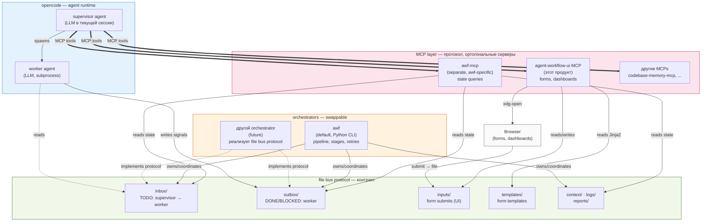

# agent-workflow-ui — Product Vision

> **Standalone UI product**, который даёт агенту инструменты визуального взаимодействия с пользователем: HTML-формы для структурированного ввода и HTML-дашборды для наблюдения за agent workflow. Работает с любым orchestrator'ом, который следует file bus протоколу (awf — default, не единственный). CLI остаётся primary medium для team play; HTML — точечный инструмент там, где chat неэффективен.

## 1. Что это и границы продукта

### 1.1 Что это

**agent-workflow-ui** — standalone UI product, реализованный как MCP server + Skill markdown. Даёт агенту (supervisor'у в opencode) инструменты для:

1. **Генерации и открытия HTML-форм** — структурированный ввод от пользователя (выбор из опций, файловые пикеры, приоритизационные матрицы, опросники).
2. **Чтения ответов** через form_id (асинхронно, без блокировки pipeline).
3. **Рендеринга HTML-дашбордов** — наблюдение за pipeline, статусами, прогрессом worker'ов.

CLI остаётся **primary medium** для dialogue, стратегических обсуждений, тонкой калибровки. HTML-интерфейсы — **supplement**, не replacement.

### 1.2 Границы продукта (scope)

**agent-workflow-ui — это НЕ часть awf.** Это **standalone UI layer**, который работает с любым agent orchestrator'ом, реализующим file bus протокол.

| Что в scope | Что НЕ в scope |
|---|---|
| MCP server с UI tools (forms, dashboards) | Orchestrator логика (pipeline, stages, retries) |
| Jinja2-шаблоны форм и дашбордов | File bus протокол (контракт, который orchestrator реализует) |
| Skill markdown с UI-политиками | LLM-агенты (живут в opencode, не в plugin) |
| File-based submit ingestion (`inputs/`) | Worker execution (это orchestrator) |
| Конфликт-резолюция при загрузке кастомных ролей/скиллов | Хранение ролей/скиллов (это orchestrator, plugin только UI) |

**Awf — default orchestrator, не единственный.** Plugin должен работать с любым orchestrator, который:
- Использует `.agentic/` (или настраиваемый path) для file bus.
- Поддерживает `inputs/` для form submits.
- Предоставляет state для dashboard queries (через свой собственный MCP server, например `awf-mcp`).

### 1.3 Архитектурный принцип

**Loose coupling через contract**:
- Orchestrator (awf или другой) → реализует file bus protocol.
- Plugin (agent-workflow-ui) → читает/пишет в file bus, не зная internals orchestrator'а.
- MCP servers → ортогональные слои: UI MCP (этот продукт), orchestrator-specific MCP (например, `awf-mcp`).

Это позволяет:
- Менять orchestrator без переписывания UI.
- Использовать UI с будущими orchestrators (не только awf).
- Публиковать plugin и awf как **отдельные пакеты** на PyPI.
- Развивать независимо.

## 2. Целевая аудитория

**Developer и PM** (не junior).

- **Developer** — хочет автоматизировать агентскую рутину, но сохранить контроль над стратегическими решениями. Уверен в CLI, opencode, готов настраивать plugin'ы. Может использовать любой orchestrator с file bus протоколом.
- **PM** — хочет видеть прогресс и принимать продуктовые решения без погружения в код. Формы дают точечный interface для влияния без необходимости знать синтаксис команд.

**Не наш user:** junior, не способный поставить opencode + plugin. Мы не оптимизируемся для этой аудитории.

## 3. Проблема

В существующем CLI-only workflow:

1. **Структурированные вводы неэффективны.** Выбор из 10 фич с приоритетами через chat — долгое печатание, error-prone, сложно вернуться назад. Согласование стека, моделей, ролей — требует многих сообщений туда-сюда.
2. **Visibility для long-running pipeline плохая.** Нужно держать терминал открытым, либо постоянно опрашивать `awf status`. Worker работает 30 минут — пользователь не видит, что происходит внутри.
3. **Onboarding трудный.** Пользователь ставит awf, не знает какие команды запускать, какие опции выбирать. README помогает, но всё равно — это порог.
4. **Контекст loss между сессиями.** Возврат к проекту через неделю требует перечитывания chat-истории. Дашборд с актуальным состоянием — лучше.
5. **Согласование конфигурации (роли, модели, pipeline) — боли нет, но и joy нет.** Это самая первая задача в любом awf-проекте, и сейчас делается текстово в `awf init`.

## 4. Решение — принцип

Три типа интерфейсов, каждый — в своей сильной стороне:

| Medium | Сильная сторона | Когда неэффективен |
|---|---|---|
| **CLI / chat** | Dialogue, tone calibration, итеративные уточнения, простые Y/N | Структурированные решения, файловые выборы, визуализация прогресса |
| **HTML-формы** | Структурированный ввод, multi-select, dropdowns, file picker, drag-and-drop | Простые Y/N, dialogue, итеративные уточнения |
| **HTML дашборд** | Прогресс pipeline, история сигналов, мониторинг | Dialogue, принятие решений |

**Эвристика «когда форма» (по умолчанию — chat):**

| Ситуация | Medium |
|---|---|
| Y/N ответ | Chat |
| Выбор из 2 вариантов с короткими описаниями | Chat |
| «Выбор из ≥4 опций с descriptions и costs» | Форма |
| «Какие модели для 3 ролей?» (nested choices) | Форма |
| «Приоритеты 10 фич» | Форма |
| «Загрузи product-vision файл» | Форма (file picker) |
| Архитектурное решение (irreversible / expensive) | Форма |
| Тактическое уточнение в работе | Chat |
| Long-running pipeline — посмотреть что происходит | Дашборд |

**Принцип:** chat по умолчанию, форма когда chat-ответ потребует долгого печатания или сложной структуры. Дашборд — для monitoring, не для decisions.

## 5. Принципы и ограничения

### Принципы

1. **CLI primary.** Chat — основная среда supervisor↔user взаимодействия. Формы — дополнение.
2. **HTML — точечный инструмент.** Не replacement CLI, а supplement там, где chat ломается.
3. **Форма — это contract.** И supervisor, и пользователь знают схему: что ожидается, какие поля, какой формат ответа.
4. **Async submit.** Form submit создаёт signal (`.agentic/inputs/<form_id>.yaml`), supervisor читает когда готов. Pipeline может ожидать signal — supervisor (LLM) не расходует токены в ожидании.
5. **Шаблоны в проекте.** `.agentic/templates/`. Коммитятся в git, versioned, переиспользуются. Supervisor должен переиспользовать существующие шаблоны; если подходящего нет — генерирует новый и добавляет в базу.
6. **Plugin реализован как MCP server + Skill markdown.** MCP даёт typed tools (агент вызывает `open_form(...)`, не bash-команду). Skill markdown даёт LLM-readable policy (когда/как использовать). Awf не меняется.
7. **Plugin agnostic.** Plugin ядро не знает про `.agentic/` напрямую — связка с awf через `supervisor.md` инструкции и через MCP tools, которые агент вызывает осознанно.
8. **Pipeline-declared forms preferred.** Статичные формы (объявленные в YAML pipeline) — preferred, понятные, дешёвые. Ad-hoc динамические формы (supervisor решает в моменте) — важная power feature, но не основной режим.

### Ограничения (что НЕ делаем)

1. **Не SPA.** Никакого React/Vue/сборщиков. Static HTML + minimal JS.
2. **Не persistent HTTP server (по умолчанию).** File-based I/O. Опциональный minimal localhost HTTP — для auto-submit, но не default.
3. **Не WebSocket.** Дашборд обновляется через meta-refresh.
4. **Не mobile-first.** Desktop browser.
5. **Не real-time collaboration.** Один пользователь — одна сессия. Multi-user — далёкий backlog.
6. **Не для junior.** Требует CLI/opencode компетенций.
7. **Не заменяет CLI.** Если форма не может — fallback на chat.
8. **Не делает architectural решений за пользователя.** Plugin предоставляет interface, не заменяет judgement.

## 6. Пользовательские сценарии

Сценарии перечислены в порядке приоритета MVP (от первого к последнему).

### Сценарий 1 (MVP — Priority 1) · Конструктор конфигурации

**Контекст:** пользователь начинает новый проект или хочет перенастроить существующий. Нужно сконфигурировать orchestrator (awf по умолчанию): роли, скиллы, модели, pipeline.

**Шаги:**
1. Пользователь в CLI: «хочу начать новый проект» (или «хочу перенастроить конфигурацию»).
2. Supervisor: «Я открыл конструктор конфигурации в браузере».
3. В браузере — форма:
   - **Роли:** multi-select из дефолтных (`worker`, `reviewer`, `tester`) + file picker для загрузки своего `.md`.
   - **Скиллы:** multi-select из библиотеки дефолтных (`backend-developer`, `frontend-developer`, …) + file picker.
   - **Модели:** dropdown для каждой выбранной роли (список берётся из opencode).
   - **Pipeline:** выбор из шаблонов (`simple`, `full`) или загрузка custom YAML.
4. **Конфликт-резолюция (если применимо):** если пользователь загрузил файл с именем, совпадающим с дефолтным, MCP server открывает follow-up мини-форму:
   - «Заменить дефолтный `worker.md`» (overwrites default).
   - «Сохранить как `worker-custom.md`» (новая роль, default сохранён).
   - «Отмена».
5. Пользователь заполняет основную форму, нажимает **Submit**.
6. Supervisor: читает submit, генерирует `.agentic/config.yaml` + `roles/` + `pipelines/` + `.gitignore`. В CLI: «Готово. Конфигурация сохранена. Что дальше?».

**Ценность:** снижает cognitive load при setup; ошибка в конфигурации (забытая роль, неверная модель) исключена — форма валидирует. Кастомные роли/скиллы подгружаются без ручного копирования файлов.

**Сложность:** средняя (одна комплексная форма + опциональная follow-up для конфликтов).

**Связанные шаблоны:** `role-assignment.html.j2`, `skill-picker.html.j2`, `model-picker.html.j2`, `pipeline-picker.html.j2`, `conflict-resolver.html.j2` (мини-форма).

---

### Сценарий 2 (Priority 2) · Decision fork в работе

**Контекст:** идёт итерация разработки. Worker упирается в архитектурную развилку — выбор библиотеки, паттерна, протокола.

**Шаги:**
1. Supervisor в CLI: «Worker упирается в выбор БД (PostgreSQL vs MongoDB vs SQLite). Я открыл форму с сравнением».
2. В браузере: decision-tree форма. 2-3 опции с описаниями, pros/cons таблицей, cost estimates, risk levels.
3. Пользователь выбирает опцию, опционально добавляет комментарий в textarea, нажимает **Submit**.
4. Supervisor: читает submit, формирует новый TODO с выбранным направлением, передаёт worker'у.

**Ценность:** структурированные архитектурные решения вместо длинных chat-обсуждений. Решение сохраняется в файле — становится частью истории проекта.

**Сложность:** низкая.

**Связанные шаблоны:** `decision-tree.html.j2`, `architecture-choice.html.j2`.

---

### Сценарий 3 (Priority 3) · Blockage recovery

**Контекст:** worker BLOCKED с описанием проблемы и N вариантами решения.

**Шаги:**
1. Supervisor в CLI: «Worker заблокирован на задаче X. Я открыл форму с вариантами решения».
2. В браузере: форма с:
   - Описание проблемы (markdown rendered).
   - Варианты решения (radio + описание каждого, risk/cost/effort).
   - Textarea для комментария/уточнения.
3. Пользователь выбирает опцию, пишет комментарий, **Submit**.
4. Supervisor: формирует исправленный TODO с учётом выбора, запускает worker.

**Ценность:** структурированная обработка проблем вместо «эскалации в chat, которая тонет в истории».

**Сложность:** средняя.

**Связанные шаблоны:** `blockage-recovery.html.j2`.

---

### Сценарий 4 (Priority 4) · Long-running pipeline monitoring

**Контекст:** `awf start --background` запущен на долгую задачу (часы).

**Шаги:**
1. Supervisor: «Pipeline запущен. Dashboard открыт в браузере».
2. В браузере: статичный HTML, meta-refresh каждые 10 секунд. Содержит:
   - Текущая стадия pipeline.
   - Прогресс worker'а (по `PROGRESS-*.md`).
   - Последние сигналы (DONE / BLOCKED / REVIEW-…).
   - Хвост лога оркестратора.
   - Git status (изменённые файлы).
3. Pipeline финиширует. Dashboard: «Готово. Вернись в CLI для verify».
4. В CLI: пользователь делает verify.

**Ценность:** transparency для долгих задач; пользователь может переключаться на другие задачи, зная что pipeline «на виду».

**Сложность:** средняя (static rendering + meta-refresh, без real-time).

**Связанные шаблоны:** `dashboard.html.j2` (статичный, заполняется данными).

---

### Сценарий 5 (Priority 5) · Priority planning session

**Контекст:** пользователь хочет спланировать roadmap или приоритизировать backlog.

**Шаги:**
1. В CLI: «хочу спланировать Q1» / «расставь приоритеты по 10 фичам».
2. Supervisor: «Я открыл priority-matrix. Перетащи фичи в нужном порядке».
3. В браузере: drag-and-drop priority list. Список фич берётся из product-vision файла или из backlog'а пользователя.
4. Пользователь расставляет, опционально помечает «must-have» / «nice-to-have», **Submit**.
5. Supervisor: читает приоритеты, генерирует N TODO (по одному на top-priority фичу), формирует pipeline, запускает.

**Ценность:** сложный ввод без typing; визуальная приоритизация лучше текстовой.

**Сложность:** высокая (drag-and-drop UI).

**Связанные шаблоны:** `priority-matrix.html.j2`.

---

### Сценарий 6 (Priority 6) · Onboarding wizard

**Контекст:** пользователь начинает с нуля, ничего не знает про awf. Хочет «просто сделать проект».

**Шаги:**
1. В CLI пользователь пишет «хочу сделать интернет-магазин» — без знания команд.
2. Supervisor открывает **первую форму**: тип проекта (web / API / mobile / desktop / ML).
3. **Submit** → supervisor анализирует, открывает **вторую форму** (стек, уже с контекстом из первой — для интернет-магазина предложены e-commerce-relevant варианты).
4. **Submit** → третья форма (функциональные требования: multi-select фич).
5. **Submit** → четвёртая (модели для ролей, на основе выбранного стека).
6. И так далее — **итеративно собирает контекст**, каждая следующая форма предзаполнена на основе предыдущих ответов.
7. После 5-7 форм supervisor генерирует `.agentic/` + `plan.md` + запускает pipeline.

**Принцип:** пользователь не знает команд. Пользователь говорит «хочу X» — агент всё остальное делает через формы.

**Ценность:** снижение порога входа до минимума. Полная «магия» для пользователя — он только отвечает на конкретные вопросы.

**Сложность:** высокая (итеративный wizard с state между формами, conditional logic).

**Связанные шаблоны:** несколько: `wizard-step-type.html.j2`, `wizard-step-stack.html.j2`, `wizard-step-features.html.j2`, `wizard-step-models.html.j2`, и т.д.

## 7. MVP scope

**MVP = Сценарий 1 (Конструктор конфигурации awf).**

### Почему Сценарий 1 — первый

1. **Дешёвый по сложности.** Одна статичная форма, без итеративного state.
2. **Самый видимый value.** Пользователь сразу видит «агент мне помог настроить проект» — яркий demo.
3. **Демонстрирует plugin concept без runtime интеграции.** Не требует работы с pipeline execution, signal polling, etc.
4. **Решает реальную боль.** Сейчас конфигурация делается текстово в `awf init` — это первая точка контакта пользователя с awf, и она может быть лучше.
5. **Хороший полигон для MCP infrastructure.** На одной форме можно отработать MCP server, skill markdown, template rendering, file-based submit — все базовые механики.

### После MVP — последовательно

По приоритету: Сценарий 2 → 3 → 4 → 5 → 6.

Каждый следующий сценарий переиспользует инфраструктуру plugin'а и добавляет одну новую сложность:
- Сценарий 2: ad-hoc forms в runtime (vs pipeline-declared).
- Сценарий 3: blockage-specific шаблоны, multimodal (текст + варианты).
- Сценарий 4: dashboard rendering, meta-refresh.
- Сценарий 5: drag-and-drop UI (new template type).
- Сценарий 6: итеративный wizard (state между формами).

## 8. Архитектурная позиция

### Стек



### Принципы стек-диаграммы

1. **opencode runtime** — общий, не зависит от наших продуктов.
2. **MCP layer** — несколько ортогональных серверов. `agent-workflow-ui` (этот продукт) — agnostic. `awf-mcp` — awf-specific. Другие MCPs (`codebase-memory-mcp`) — посторонние.
3. **Orchestrators** — swappable. awf — default, но plugin не знает его internals. Любой orchestrator, реализующий file bus protocol, совместим.
4. **File bus** — контракт между всеми слоями. Структура `.agentic/` описана в `protocols/communication.md`.
5. **Browser** — terminal UI для forms/dashboards. Открытие через `xdg-open`/`open`.

### Что меняется при смене orchestrator'а

Если завтра появится альтернативный orchestrator (например, переписанный на Go, или совершенно новый продукт):
- `agent-workflow-ui` работает **без изменений** (читает `inputs/`, пишет forms).
- `awf-mcp` заменяется на `<new-orchestrator>-mcp`.
- File bus protocol либо совместим, либо требуется миграция (но это зона ответственности orchestrator'а).

**Это и есть «не быть заложником текущей версии awf».**

## 9. Принятые решения

Все принципиальные вопросы закрыты 2026-07-25 после совместного обсуждения. Решения зафиксированы как **контракт vision v0.2** — пересмотру не подлежат без явного bug-ridden обоснования.

### 9.1 Идентичность product'а

**Q1 · Имя:** **`agent-workflow-ui`**. Не `agent-ui`, не `awf-ui`. Описательное, не конфликтует с именем awf, явная связь с агентской разработкой. Имя фиксирует **standalone** природу продукта (UI для любого agent workflow, не только awf).

**Q2 · Расположение plugin (пересмотрено в v0.3):** **отдельная директория верхнего уровня `/agent_workflow_ui/` в том же репо (monorepo).** НЕ подпакет в `awf/`.

Структура репо:
```
agentic-workflow/                 # monorepo
├── awf/                          # orchestrator (Python package)
├── agent_workflow_ui/            # UI plugin (Python package, standalone)
│   ├── __init__.py
│   ├── mcp_server.py             # MCP server implementation
│   ├── skill/
│   │   └── SKILL.md              # policy: когда/как использовать формы
│   ├── templates/                # default form/dashboard templates (Jinja2)
│   └── pyproject.toml            # отдельный package на PyPI
├── awf_mcp/                      # (future) awf-specific MCP server
├── templates/                    # awf templates (roles, pipelines)
├── tests/
├── pyproject.toml                # workspace metadata
└── ...
```

**Принципы:**
- Awf и agent-workflow-ui — **два независимых продукта** в одном репо.
- Каждый публикуется как **отдельный package** на PyPI.
- Связь между ними — только через **file bus protocol** (`protocols/communication.md`).
- Awf-core не зависит от plugin'а. Plugin не зависит от awf internals (только от file bus contract).
- При необходимости plugin можно вынести в отдельный репо без архитектурных изменений.

### 9.2 Data flow

**Q3 · Data return mechanism:** **file-based default**. Submit form → MCP server writes `.agentic/inputs/<form_id>.yaml`. Опциональный minimal localhost HTTP server для auto-submit (form JS POST → server → file) — будет рассмотрен в архитектуре, **не обязателен для MVP**.

**Q4 · Form validation — три уровня, разная ответственность:**

| Уровень | Где | За что отвечает |
|---|---|---|
| **JS client-side** | В форме (browser) | Required-поля, базовый формат (email/number/length) |
| **MCP server** | При submit | Semantic validation: опция существует, файл валидный, значение в допустимом диапазоне |
| **Supervisor (LLM)** | После submit, при обработке | Semantic judgment: выбор не противоречит предыдущим решениям, имеет смысл в контексте проекта |

### 9.3 Template lifecycle

**Q5 · Versioning шаблонов:** **не делаем.** История submit'ов не важна. Если template изменился — новые submit'ы используют новый template, старые ignore. Старые submit'ы лежат в `.agentic/inputs/` как исторические артефакты (не удаляются, но и не валидируются).

**Q6 · Composition:** **только flat templates.** Если нужно несколько форм — последовательный вызов: форма 1 → submit → supervisor анализирует → форма 2 (с контекстом из 1) → submit → и т.д. (это же паттерн Сценария 6 — Onboarding wizard).

**Q7 · Template format:** **Jinja2.** Стандарт Python, низкий порог, мощный (extends, macros, filters), знакомый по Flask/Django. Не Django templates напрямую — Jinja2 standalone (Django templates основаны на нём, но standalone проще).

### 9.4 UX

**Q8 · Environment fragility:** **не делаем detection, не делаем fallback.** Если у пользователя не открывается browser — он сам ответственен за починку окружения. Plugin возвращает error, supervisor видит и сообщает пользователю: «не получилось открыть форму, проверь browser/окружение». Это **философский выбор**: мы оптимизируемся для нормального случая, не для всех edge cases.

**Q9 · Dashboard refresh:** **от простого к сложному.** MVP — meta-refresh 10 сек. JS polling (smooth, но сложнее) — backlog. SSE (real-time) — far backlog.

**Q10 · Form ID:** **timestamp-based, человеко-читаемый.** Формат: `FORM-YYYYMMDDHHMMSS-NNN`, где NNN — счётчик внутри секунды (если несколько форм создано одновременно). Например: `FORM-20260725143022-001`. Не UUID — readability важнее microsecond-precision.

**Q11 · Pipeline не держит waiter-process.** Submit — асинхронное событие. Supervisor реагирует на submit как **hook**: когда submit-файл появляется → supervisor (через MCP tool `read_submit(form_id)`) его видит и продолжает работу. **Никакого фонового подпроцесса ожидания.** Если pipeline дошёл до `request_input` стадии и submit'а ещё нет — pipeline останавливается (как при любой supervisor-стадии), ожидает ручного continue или submit.

### 9.5 Boundary с awf

**Q12 · Plugin agnostic через MCP-параметр `inputs_dir`.** MCP server configured при запуске с параметром `inputs_dir` (например, `.agentic/inputs/`). Awf (через `awf init`) создаёт MCP server config с правильным путём. Agent не передаёт путь каждый раз — MCP server знает default. При необходимости agent может override (например, для тестов).

**Q13 · Два отдельных MCP server'а:**

| MCP server | Назначение | Что знает про awf |
|---|---|---|
| **`agent-workflow-ui`** (этот vision) | Forms, dashboards, UI tools | Ничего. Agnostic. |
| **`awf-mcp`** (отдельный, future) | Awf state queries: `get_active_todos`, `get_pipeline_state`, `get_progress` | Всё про `.agentic/`. Awf-specific. |

Это даёт **чистое разделение**: UI layer полностью agnostic (можно использовать с любым agent system), awf-layer специфичен (только для awf).

### 9.6 Вопросы, оставленные для архитектуры

Эти детали не принципиальны для vision, решатся при проработке `vision/architecture.md`:

- Точный список MCP tools (signatures, return types).
- Внутренняя структура `awf/agent_workflow_ui/` (модули, классы).
- Transport MCP (stdio vs HTTP) — opencode-specific, не влияет на vision.
- Конкретные Jinja2-шаблоны для MVP (Сценарий 1).
- Структура `supervisor.md` обновлений для формы-политик.

## 10. Дальнейшие шаги

1. ✅ ~~Согласовать vision~~ — выполнено, v0.2 зафиксирована.
2. **Переработать `BACKLOG.md`** под новый vision. Старые Tasks 1-7 (HTML dashboard, HTTP API, bootstrap, real-time) — deprecated, перепрофилировать под новые 6 сценариев.
3. **Проработать архитектуру** (отдельный документ `vision/architecture.md`): MCP server design (`awf/agent_workflow_ui/`), Jinja2 template rendering, form lifecycle (open → submit → MCP hook), file-based I/O, три validation layers.
4. **Проработать MVP** (Сценарий 1 — Конструктор конфигурации): детали 4 templates (`role-assignment`, `skill-picker`, `model-picker`, `pipeline-picker`), MCP tool signatures, skill markdown draft, integration с `awf init`.
5. **Реализовать MVP.** Получить feedback. Итерировать.
6. **Расширять по приоритетам** — Сценарии 2, 3, 4, 5, 6.

---

**Версия документа:** v0.3 (standalone product framing, monorepo with separate top-level package)
**Дата последнего обновления:** 2026-07-25
**Зафиксированные принципы:**
- **Standalone UI product**, не часть awf. Awf — default orchestrator, не единственный.
- CLI primary, async submit (hook model, без waiter-process).
- Templates в проекте (`.agentic/templates/`), без versioning, без composition.
- MCP-based plugin (`agent-workflow-ui`), Jinja2 template engine, timestamp-based form IDs.
- Plugin agnostic через MCP-параметр `inputs_dir`, отдельный `awf-mcp` для state queries.
- **Расположение:** `/agent_workflow_ui/` в monorepo, отдельный package на PyPI.
- Conflict resolution при загрузке кастомных ролей/скиллов (replace / save-as / cancel).
**Что осталось для архитектуры:** точные MCP tool signatures, internal module structure, transport, конкретные Jinja2 templates для MVP.
