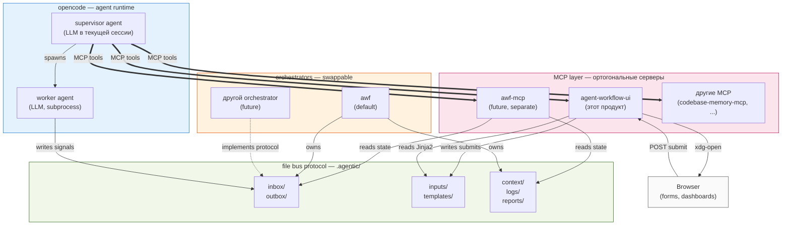

# agent-workflow-ui — Architecture

> Архитектурный документ для `agent-workflow-ui` — standalone UI plugin к opencode, который даёт агенту инструменты визуального взаимодействия с пользователем: HTML-формы для структурированного ввода и HTML-дашборды для наблюдения за agent workflow.

**Версия:** 1.0
**Дата:** 2026-07-25
**Связанные документы:** [Product Vision](agent-ui-plugin.md), [File Bus Protocol](../protocols/communication.md), [awf README](../README.md)

---

## 1. Overview

### 1.1 Что это

`agent-workflow-ui` — Python-пакет, реализованный как MCP server. Работает внутри opencode, даёт supervisor-агенту инструменты для:

- **Генерации и открытия HTML-форм** в браузере пользователя.
- **Чтения ответов** через типизированные MCP tool calls.
- **Рендеринга HTML-дашбордов** (future scope).

Plugin работает с **любым agent orchestrator'ом**, реализующим file bus протокол (awf — default, не единственный).

### 1.2 Для кого

- **Пользователь** (developer / PM): получает привычный визуальный интерфейс для сложных решений вместо длинных chat-ответов.
- **Агент** (supervisor LLM): получает структурированный ввод вместо свободного текста, меньше ошибок интерпретации.
- **Orchestrator** (awf или другой): не меняется, plugin работает поверх его file bus.

### 1.3 Главные свойства

- CLI остаётся primary medium; HTML-формы — supplement для случаев, где chat неэффективен.
- Plugin **не зависит от awf internals** — только от file bus контракта.
- Submit'ы попадают в plugin **автоматически** через локальный HTTP endpoint (стандартный HTML `<form method="POST">`).
- Templates коммитятся в git (часть дизайна проекта), submits — runtime state (gitignored).

---

## 2. Context

### 2.1 Где plugin живёт в ecosystem



### 2.2 Принципы интеграции

- **opencode runtime** — общий, не зависит от наших продуктов.
- **MCP layer** — несколько ортогональных серверов. `agent-workflow-ui` — agnostic. `awf-mcp` — awf-specific.
- **Orchestrators** — swappable. Plugin не знает internals orchestrator'а, только file bus contract.
- **File bus** — единственный контракт между слоями. Реализован в `.agentic/` директории проекта.

---

## 3. Принципы и ограничения

### 3.1 Принципы

1. **CLI primary, HTML supplement.** Chat — основная среда supervisor↔user взаимодействия. HTML-формы — дополнение там, где chat ломается (выбор из 4+ опций, файловые пикеры, приоритизация).
2. **Standalone product.** Plugin не зависит от awf internals, только от file bus протокола. Публикуется как отдельный package на PyPI.
3. **MCP как единственный interface.** Агент вызывает plugin только через typed MCP tools. Никаких bash-команд или ручных file reads.
4. **Submit автоматический через HTTP.** Пользователь нажимает Submit → данные автоматически попадают в plugin через локальный HTTP endpoint. Стандартный HTML form POST.
5. **Templates — часть проекта.** Шаблоны форм живут в `.agentic/templates/` и коммитятся в git (как `pipelines/`). Submits — runtime state, gitignored.

### 3.2 Ограничения

| Ограничение | Обоснование |
|---|---|
| MCP transport: stdio | Стандарт для opencode local plugins. HTTP/remote — future. |
| Python ≥ 3.9 | Совпадает с awf. |
| Single-user, single-session | Multi-user — far future. |
| Desktop browser только | Mobile/CLI-only — не target audience. |
| Runtime dependencies: PyYAML, Jinja2 | Минимум. |
| Browser open через `xdg-open`/`open` | Без native browser bindings. |

---

## 4. Components

### 4.1 Внутренняя структура plugin'а

```
agent_workflow_ui/
├── __init__.py
├── __main__.py                # entry: python -m agent_workflow_ui
├── server.py                  # MCP server (stdio transport)
├── http_endpoint.py           # localhost HTTP для приёма submits
├── browser.py                 # xdg-open / open wrapper
├── config.py                  # env vars, paths
├── state.py                   # in-memory registry of open forms
├── tools/                     # MCP tool implementations
│   ├── forms.py               # open_form, read_submit, cancel_form, list_pending_forms
│   └── templates.py           # list_templates
├── render/                    # Jinja2 rendering layer
│   ├── engine.py              # Environment setup, filters
│   ├── frontmatter.py         # YAML frontmatter parser
│   └── default_templates/     # templates shipped with plugin
│       ├── role-assignment.html.j2
│       ├── skill-picker.html.j2
│       ├── model-picker.html.j2
│       ├── pipeline-picker.html.j2
│       └── conflict-resolver.html.j2
├── pyproject.toml             # package metadata (separate dist)
└── SKILL.md                   # policy для LLM
```

### 4.2 Component responsibilities

| Компонент | Ответственность |
|---|---|
| `server.py` | MCP protocol handling, tool dispatch, lifecycle. |
| `http_endpoint.py` | Localhost HTTP server, accepts `/submit/<form_id>` POSTs, writes YAML to `inputs/`. |
| `browser.py` | Cross-platform browser open (`xdg-open` Linux, `open` macOS, fallback error). |
| `config.py` | Reads env vars at startup, resolves paths against cwd opencode. |
| `state.py` | In-memory registry: `{form_id, template, opened_at, status}`. File system = source of truth, registry = cache for fast `list_pending_forms`. |
| `tools/forms.py` | Implements form lifecycle tools. |
| `tools/templates.py` | Implements template discovery. |
| `render/engine.py` | Jinja2 environment with autoescape, filters, globals (`submit_url`, `form_id`, `template_name`). |
| `render/frontmatter.py` | Parses YAML frontmatter at top of `.html.j2` files. |
| `render/default_templates/` | Templates shipped with plugin. Project templates (`.agentic/templates/`) override by name. |

### 4.3 Lifecycle

Plugin запускается opencode как subprocess при старте сессии:

1. opencode spawns `python -m agent_workflow_ui`.
2. Plugin reads env vars (`AWF_INPUTS_DIR`, `AWF_TEMPLATES_DIR`, `AWF_HTTP_PORT`, ...).
3. Plugin создаёт директории если отсутствуют.
4. Plugin запускает HTTP endpoint на `127.0.0.1:AWF_HTTP_PORT` (default: auto-select free port).
5. Plugin регистрирует MCP tools через stdio protocol.
6. Живая, пока жива opencode сессия.
7. При shutdown — cleanup временных HTML файлов в temp dir.

---

## 5. Form lifecycle

### 5.1 Полный flow (на примере)

Сценарий: пользователь начинает новый проект. Агент хочет спросить про технологический stack.

1. **Пользователь** в CLI: «хочу начать новый проект, интернет-магазин».
2. **Агент** решает спросить через форму, вызывает `open_form(template="role-assignment", data={project_name: "internet-shop", available_roles: ["worker", "reviewer", "tester"]})`.
3. **Plugin:**
   - Генерирует `form_id` (`FORM-001`).
   - Рендерит Jinja2 template, inject'ит `submit_url=http://localhost:PORT/submit/FORM-001`.
   - Сохраняет HTML во временный файл.
   - Открывает browser (`xdg-open`).
   - Записывает в registry: `{form_id: "FORM-001", status: "pending"}`.
   - Возвращает агенту: `{form_id: "FORM-001", browser_opened: true, submit_url: "..."}`.
4. **Агент** в CLI: «Я открыл форму в браузере. Заполни и нажми Submit».
5. **Пользователь** заполняет форму в браузере, нажимает **Submit**.
6. **Browser** отправляет стандартный HTML form POST на `http://localhost:PORT/submit/FORM-001`.
7. **Plugin's HTTP endpoint** ловит POST, сериализует form data в YAML, пишет в `.agentic/inputs/FORM-001.yaml`. Browser показывает страницу «Submitted!».
8. **Агент** вызывает `read_submit(form_id="FORM-001")`.
9. **Plugin** читает YAML, возвращает: `{submitted: true, data: {...}, submitted_at: "..."}`.
10. **Агент** анализирует данные, генерирует `.agentic/config.yaml` + roles + pipelines, сообщает пользователю «готово».

### 5.2 Failure modes

| Ситуация | Поведение |
|---|---|
| Browser не открылся | `open_form` возвращает `{browser_opened: false, error: "..."}`. Агент сообщает пользователю. |
| Submit неполный (required fields пустые) | HTML5 form validation (`required`) блокирует submit в browser. Пользователь видит стандартное сообщение. |
| Submit semantic invalid (валидный YAML, но неверный выбор) | Агент получает данные через `read_submit`, валидирует semantic на LLM-side. При ошибке открывает новую форму с pre-filled данными и комментарием. |
| Submit не пришёл | `read_submit` возвращает `{submitted: false, status: "pending"}`. Агент может подождать, отменить через `cancel_form`, или продолжить другую работу. |
| Duplicate submit | Plugin идемпотентен по `form_id`. Повторные POST на `/submit/FORM-001` игнорируются после первого. |
| Concurrent `open_form` | Каждый вызов создаёт новый `form_id`. Старый остаётся pending. |
| Agent перезапустился между `open_form` и `read_submit` | Form ID — это имя файла в `.agentic/inputs/`. Новый агент вызывает `read_submit(form_id)` и читает файл. Stateless recovery. |

---

## 6. MCP Tools (Reference)

### 6.1 `open_form`

Открыть HTML форму в браузере пользователя.

**Аргументы:**

| Имя | Тип | Required | Описание |
|---|---|---|---|
| `template` | string | yes | Имя template (без расширения, например `"role-assignment"`). |
| `data` | object | no | Переменные для рендеринга. |
| `ttl_seconds` | int | no | Авто-отмена через N секунд. Default: без TTL. |

**Возвращает:**

```json
{
  "form_id": "FORM-001",
  "browser_opened": true,
  "submit_url": "http://localhost:13747/submit/FORM-001",
  "expires_at": null
}
```

**При ошибке:**

```json
{
  "form_id": "FORM-002",
  "browser_opened": false,
  "error": "Browser open failed: xdg-open exit code 1"
}
```

**Внутри:**
1. Сгенерировать form_id (следующий sequence).
2. Найти template: `.agentic/templates/<name>.html.j2` (project override) → `render/default_templates/<name>.html.j2` (default).
3. Рендерить Jinja2 с переменными `form_id`, `submit_url`, `template_name` + ключи из `data`.
4. Сохранить HTML во временный файл (`/tmp/agent-workflow-ui-<form_id>.html`).
5. Запустить `xdg-open`/`open`.
6. Записать в registry: `{form_id, template, opened_at, status: "pending"}`.

---

### 6.2 `read_submit`

Проверить, заполнил ли пользователь форму, и если да — вернуть данные.

**Аргументы:**

| Имя | Тип | Required | Описание |
|---|---|---|---|
| `form_id` | string | yes | ID формы, открытой через `open_form`. |

**Возвращает (форма pending):**

```json
{
  "submitted": false,
  "form_id": "FORM-001",
  "status": "pending",
  "opened_at": "2026-07-25T14:30:22Z"
}
```

**Возвращает (форма submitted):**

```json
{
  "submitted": true,
  "form_id": "FORM-001",
  "status": "submitted",
  "submitted_at": "2026-07-25T14:31:45Z",
  "template": "role-assignment",
  "data": {
    "selected_roles": ["worker", "reviewer"],
    "project_name": "internet-shop"
  }
}
```

**Возвращает (форма cancelled):**

```json
{
  "submitted": false,
  "form_id": "FORM-001",
  "status": "cancelled",
  "cancelled_at": "2026-07-25T14:35:00Z"
}
```

**Поведение:**
- Idempotent —多次ые вызовы возвращают тот же результат.
- Не блокирует агент.

---

### 6.3 `cancel_form`

Отменить форму. Submit'ы для отменённой формы игнорируются.

**Аргументы:**

| Имя | Тип | Required | Описание |
|---|---|---|---|
| `form_id` | string | yes | ID формы. |

**Возвращает:**

```json
{ "cancelled": true, "form_id": "FORM-001" }
```

**При попытке отменить уже submitted:**

```json
{ "cancelled": false, "form_id": "FORM-001", "reason": "already_submitted" }
```

---

### 6.4 `list_pending_forms`

Возвращает формы, открытые и ещё не submitted/cancelled.

**Аргументы:** нет.

**Возвращает:**

```json
{
  "pending": [
    {
      "form_id": "FORM-001",
      "template": "role-assignment",
      "opened_at": "2026-07-25T14:30:22Z",
      "age_seconds": 45
    }
  ],
  "count": 1
}
```

---

### 6.5 `list_templates`

Возвращает все доступные templates — default (из plugin'а) и project-level (из `.agentic/templates/`).

**Аргументы:** нет.

**Возвращает:**

```json
{
  "templates": [
    {
      "name": "role-assignment",
      "source": "default",
      "description": "Multi-select ролей для проекта",
      "required_data_keys": ["available_roles"],
      "optional_data_keys": ["default_selection", "project_name"]
    },
    {
      "name": "stack-picker",
      "source": "project",
      "description": "Custom stack template for this project",
      "required_data_keys": ["project_type"],
      "optional_data_keys": []
    }
  ]
}
```

**Project templates override defaults по имени.** Если в `.agentic/templates/role-assignment.html.j2` есть файл — он используется вместо default.

---

## 7. File bus contract

### 7.1 Directory extensions to `.agentic/`

| Directory | Назначение | Gitignored? | Naming |
|---|---|---|---|
| `.agentic/inputs/` | Submit файлы (от browser к агенту) | yes | `<form_id>.yaml` |
| `.agentic/templates/` | Jinja2 templates (project-scoped) | no (committed) | `<name>.html.j2` |
| `.agentic/dashboards/` | Rendered dashboards (transient) | yes | `<name>.html` |

### 7.2 Submit file format

**Path:** `.agentic/inputs/<form_id>.yaml`

```yaml
form_id: FORM-001
template: role-assignment
submitted_at: 2026-07-25T14:31:45Z
data:
  # Структура зависит от template. Пример для role-assignment:
  selected_roles:
    - worker
    - reviewer
  project_name: internet-shop
```

**Schema:**
- `form_id` (string, required) — совпадает с именем файла без `.yaml`.
- `template` (string, required) — какой template использовался.
- `submitted_at` (ISO 8601 UTC, required) — когда пользователь нажал Submit.
- `data` (object, required) — payload из формы. Структура определяется HTML form fields.

### 7.3 Template file format

**Path:** `.agentic/templates/<name>.html.j2` (project) или `render/default_templates/<name>.html.j2` (default).

**Структура:** YAML frontmatter + Jinja2 template.

```jinja2
---
description: Выбор ролей для проекта
required_data_keys:
  - available_roles
optional_data_keys:
  - default_selection
  - project_name
---
<!DOCTYPE html>
<html lang="ru">
<head>
  <meta charset="UTF-8">
  <title>Выбор ролей — {{ project_name | default("проект") }}</title>
  <style>
    body { font-family: system-ui, sans-serif; max-width: 600px; margin: 40px auto; padding: 0 20px; }
    label { display: block; padding: 8px 0; }
    .actions { margin-top: 24px; }
    button { padding: 8px 24px; font-size: 16px; }
  </style>
</head>
<body>
  <h1>Выберите роли для проекта «{{ project_name | default("без названия") }}»</h1>

  <form action="{{ submit_url }}" method="POST">
    <fieldset>
      <legend>Роли</legend>
      
      <label>
        <input type="checkbox" name="selected_roles" value="{{ role }}"
          checked>
        {{ role }}
      </label>
      
    </fieldset>

    <input type="hidden" name="project_name" value="{{ project_name | default('') }}">

    <div class="actions">
      <button type="submit">Submit</button>
    </div>
  </form>
</body>
</html>
```

**Plugin-injected variables (доступны всем templates):**
- `{{ form_id }}` — ID текущей формы.
- `{{ submit_url }}` — URL для `<form action="...">`.
- `{{ template_name }}` — имя текущего template.

**Agent-supplied variables:** любые ключи из `data` параметра `open_form`.

### 7.4 Form ID format

`FORM-001`, `FORM-002`, ..., `FORM-NNN` — простой sequence в рамках проекта.

**Генерация:** plugin вычисляет next ID как max существующий NNN + 1 (сканирование `.agentic/inputs/FORM-*.yaml`). Альтернатива: счётчик в `.agentic/inputs/.counter` (TBD при реализации, §11).

**Коллизии:** невозможны — single-user, single-session.

---

## 8. Configuration

### 8.1 Environment variables

Передаются opencode при spawn subprocess:

| Env var | Default | Описание |
|---|---|---|
| `AWF_INPUTS_DIR` | `.agentic/inputs` | Куда пишутся submits (relative to cwd opencode = project root). |
| `AWF_TEMPLATES_DIR` | `.agentic/templates` | Project-level templates. |
| `AWF_HTTP_PORT` | `0` (auto-select) | Порт HTTP endpoint. `0` = автоматически выбрать свободный. |
| `AWF_OPEN_BROWSER_CMD` | `auto` | `xdg-open` / `open` / `auto` (detect platform). |
| `AWF_TEMP_DIR` | `/tmp` | Куда писать временные HTML файлы. |
| `AWF_DEFAULT_TTL_SECONDS` | `86400` (24h) | Default TTL для forms без явного `ttl_seconds`. |

### 8.2 opencode.json integration

```json
{
  "mcp": {
    "agent-workflow-ui": {
      "type": "local",
      "command": ["python3", "-m", "agent_workflow_ui"],
      "environment": {
        "AWF_INPUTS_DIR": ".agentic/inputs",
        "AWF_TEMPLATES_DIR": ".agentic/templates"
      }
    }
  }
}
```

При установке plugin'а пользователь добавляет этот блок в `~/.config/opencode/opencode.json`. После этого plugin автоматически запускается при старте opencode сессии.

В будущем — `awf init` может предлагать добавить эту конфигурацию автоматически.

### 8.3 HTTP endpoint

- **Bind:** `127.0.0.1` только. Не доступен снаружи.
- **Port:** `AWF_HTTP_PORT` или auto-select.
- **Endpoints:**
  - `POST /submit/<form_id>` — принять submit. Body: form-encoded HTML form data (стандартный `<form method="POST">`).
  - `GET /health` — health check.
- **Limits:**
  - Max body size: 1MB.
  - `form_id` валидируется на соответствие открытой форме.
  - Прочие paths отбрасываются.

---

## 9. SKILL — policy for LLM

Skill markdown (`SKILL.md`) — инструкция для LLM, когда и как использовать формы. Копируется в `~/.config/opencode/skills/agent-workflow-ui/SKILL.md` при установке.

```markdown
# Agent Workflow UI

Используй формы для структурированного ввода от пользователя. HTML-формы
эффективнее chat для выбора из множества опций, файловых загрузок, приоритизации.

## Когда использовать форму

Используй `open_form` когда:
- Нужно выбрать из 4+ опций с описаниями (→ template `decision-tree`).
- Нужно выбрать роли/скиллы/модели для проекта (→ `role-assignment`, `model-picker`).
- Нужен file upload (product-vision, custom role .md).
- Нужно расставить приоритеты (→ `priority-matrix`).
- Long-running pipeline — показать dashboard (→ `dashboard`).

## Когда НЕ использовать форму (использовать chat)

- Y/N ответ.
- Выбор из 2-3 коротких вариантов.
- Уточнения в процессе работы.
- Tone calibration, обсуждение подхода.

## Pattern использования

1. Агент решает «нужна форма».
2. Вызывает `open_form(template=..., data=...)` — получает `form_id`.
3. Сообщает пользователю в CLI: «Я открыл форму в браузере. Заполни и нажми Submit.»
4. Продолжает другую работу (форма асинхронна) ИЛИ периодически вызывает
   `read_submit(form_id)` для проверки.
5. Когда `read_submit` возвращает `submitted: true` — анализирует `data`, продолжает.
6. Если данные semantically некорректны — открывает новую форму с pre-filled
   данными и пояснением ошибки.
7. Если передумал — `cancel_form(form_id)`.

## Доступные templates

Список доступных templates: вызови `list_templates`. Базовые:
- `role-assignment` — multi-select ролей + кастомные.
- `skill-picker` — multi-select скиллов + кастомные.
- `model-picker` — dropdown моделей для каждой роли.
- `pipeline-picker` — radio (simple / full / custom file).
- `conflict-resolver` — мини-форма (replace / save-as / cancel).

## Mistakes to avoid

- НЕ открывай форму для Y/N ответов.
- НЕ открывай >3 форм одновременно (пользователь запутается).
- НЕ забывай сообщить пользователю в CLI, что форма открыта в браузере.
- НЕ блокируйся на `read_submit` — он async. Между poll'ами делай полезную работу
  или жди разумное время (5-15 сек между вызовами).
- НЕ используй формы как replacement chat — они supplement, не primary.
```

---

## 10. Testing

### 10.1 Unit tests (`tests/agent_workflow_ui/`)

| File | Что тестирует |
|---|---|
| `test_render.py` | Jinja2 rendering с разными data, валидность HTML, contains `submit_url`. |
| `test_forms.py` | Tool logic: `open_form` генерирует form_id, `read_submit` читает файлы, `cancel_form` помечает. |
| `test_browser.py` | Mock subprocess для `xdg-open`/`open`, fallback error handling. |
| `test_http_endpoint.py` | POST на `/submit/<form_id>` → файл пишется, duplicate handling, max body size. |
| `test_templates.py` | Default templates render без errors с minimum required data. |
| `test_frontmatter.py` | YAML frontmatter parsing, malformed frontmatter errors. |

Fixtures: `tmp_path` для изоляции. Не трогают реальную filesystem.

### 10.2 Integration tests (`tests/integration/`)

| File | Что тестирует |
|---|---|
| `test_form_lifecycle.py` | Full lifecycle: spawn MCP server как subprocess, имитировать tool calls через stdio, проверять responses. |
| `test_submit_via_http.py` | MCP server запущен, реальный HTTP POST через `requests`, проверить файл в `inputs/`. |

### 10.3 E2E tests (future)

С реальным browser через `playwright`. Не в MVP.

### 10.4 Coverage target

≥80% на `agent_workflow_ui/`. Awf coverage не меняется (plugin — отдельный package).

---

## 11. Migration path

### 11.1 Для существующих пользователей awf

- **Awf core** — ничего не меняется. CLI работает как прежде.
- **`awf init`** — получит опциональный prompt: «Установить agent-workflow-ui plugin? [y/N]». Если yes — добавляет конфиг в `~/.config/opencode/opencode.json`.
- **Существующие `.agentic/` структуры** — обратная совместимость. Папки `inputs/`, `templates/` создаются при первом `open_form`, не при `awf init`.

### 11.2 Изменения в `.gitignore`

Добавляются строки:
```
.agentic/inputs/
.agentic/dashboards/
```

### 11.3 Установка plugin (для новых пользователей)

```bash
pip install agent-workflow-ui
```

После установки — добавить блок в `~/.config/opencode/opencode.json` (см. §8.2). В будущем — CLI helper для авто-настройки.

---

## 12. Scope

### 12.1 В MVP (Сценарий 1 — Конструктор конфигурации)

✅ Включено:
- MCP server с 5 tools (`open_form`, `read_submit`, `cancel_form`, `list_pending_forms`, `list_templates`).
- HTTP endpoint для приёма submits.
- Jinja2 rendering.
- 5 базовых templates: `role-assignment`, `skill-picker`, `model-picker`, `pipeline-picker`, `conflict-resolver`.
- Browser open через `xdg-open`/`open`.
- File bus: `.agentic/inputs/`, `.agentic/templates/`.

❌ НЕ включено:
- Dashboards (Сценарий 4 — later).
- Decision-tree forms в runtime (Сценарий 2 — later).
- Pipeline-declared forms через `action: request_input` (future).
- `awf-mcp` separate MCP server (future).
- HTTP remote transport (future).
- Real-time updates via SSE/WebSocket (far future).
- Multi-user (far future).

### 12.2 После MVP — по приоритету сценариев

| Сценарий | Что добавляет |
|---|---|
| 2 (Decision fork) | Runtime ad-hoc forms (в любом месте pipeline). |
| 3 (Blockage recovery) | Шаблон `blockage-recovery.html.j2`, multi-step flow. |
| 4 (Monitoring) | Dashboard rendering, `dashboard.html.j2`, meta-refresh. |
| 5 (Priority planning) | Drag-and-drop UI (сложнее, новый тип template). |
| 6 (Onboarding wizard) | Multi-form state, conditional logic между формами. |

---

## 13. Decision log

Принципиальные архитектурные решения с обоснованием (без history of consideration — только final rationale).

| Решение | Обоснование |
|---|---|
| MCP transport: stdio | Стандарт для opencode local plugins (codebase-memory-mcp pattern). HTTP/remote — future. |
| HTTP endpoint для submits (всегда включён) | Smooth UX: пользователь нажимает Submit → данные автоматически попадают в plugin. Никаких ручных скачиваний файла. |
| Form ID = sequence (`FORM-001`) | Single-user, single-session — никогда не будет 2 форм в одну секунду. Человеко-читаемый, как `TODO-0001` в awf. |
| MCP SDK = official `mcp` package | Не пишем свою реализацию JSON-RPC protocol. Стандарт, как `requests` для HTTP. |
| Нативный HTML `<form method="POST">` | Browser сам отправляет данные. Никакого JS injection, никаких YAML serializers в JavaScript. |
| Jinja2 templates | Стандарт Python-шаблонизатор (Flask, Django, Ansible). Простой синтаксис, мощные возможности. |
| Templates коммитятся в git | Часть дизайна проекта, как `pipelines/`. Submits — runtime state, gitignored. |
| Browser open через `xdg-open`/`open` | Без native browser bindings. Используем браузер по умолчанию пользователя. |
| `awf-mcp` отдельный от `agent-workflow-ui` | Clean separation: UI layer agnostic, awf layer specific. Plugin reusable с другими orchestrators. |
| Standalone package на PyPI | Не быть заложником текущей версии awf. Plugin работает с любым orchestrator'ом, реализующим file bus. |
| Pipeline-declared forms отложены | MVP (Сценарий 1) — setup wizard, не pipeline stage. Pipeline-declared — future, когда runtime scenarios (2-5). |

---

## 14. Open questions

Вопросы, которые решатся при кодинге MVP:

1. **MCP SDK конкретная версия** — `mcp>=0.5` или иная. Зафиксируется при первой попытке `pip install`.
2. **HTTP port auto-selection** — bind на port 0, получить фактический port через socket API.
3. **In-memory state vs stateless** — держать registry открытых форм в памяти для быстрых ответов, file system как source of truth для recovery.
4. **Form ID counter storage** — `.agentic/inputs/.counter` файл или max existing NNN + 1?
5. **Template frontmatter parser** — PyYAML для парсинга YAML блока в начале `.html.j2`.
6. **HTML escaping** — Jinja2 autoescape включён по умолчанию; для user-provided data — обязательно.
7. **Error response shape** — стандартный MCP error response с `code`, `message`, `data`.
8. **Submit acknowledgement page** — после POST browser показывает страницу «Submitted!» с кнопкой «вернуться в CLI». Дизайн страницы — при реализации.

---

## 15. Glossary

| Термин | Определение |
|---|---|
| **MCP** | Model Context Protocol — стандарт от Anthropic для связи LLM-агентов с инструментами. |
| **MCP server** | Процесс, реализующий MCP protocol и предоставляющий tools/resources агентам. |
| **MCP tool** | Типизированная функция, доступная агенту через MCP. |
| **Plugin** | В контексте этого документа — `agent-workflow-ui` package. |
| **Opencode** | Agent runtime, в котором работают supervisor и worker. |
| **Supervisor** | Агент (LLM), работающий в текущей opencode сессии, планирует и верифицирует. |
| **Worker** | Агент (LLM), spawn'имый supervisor'ом через `opencode run`. |
| **Orchestrator** | Система, координирующая pipeline agentic работы. Awf — default. |
| **File bus** | Контракт взаимодействия между агентами и orchestrator'ом через файлы в `.agentic/`. |
| **Form** | HTML страница с полями для структурированного ввода пользователя. |
| **Submit** | Действие пользователя (нажатие кнопки Submit в форме), инициирующее POST на HTTP endpoint. |
| **Template** | Jinja2 файл (`.html.j2`) с YAML frontmatter, описывает структуру формы. |

---

## 16. Related documents

- [`vision/agent-ui-plugin.md`](agent-ui-plugin.md) — Product Vision (что и зачем).
- [`protocols/communication.md`](../protocols/communication.md) — File bus protocol spec (будет обновлён с `.agentic/inputs/` и `.agentic/templates/` секциями после реализации plugin'а).
- [`README.md`](../README.md) — awf README.
- [`BACKLOG.md`](../BACKLOG.md) — план развития (будет переписан под standalone framing).
- [MCP specification](https://modelcontextprotocol.io/) — Model Context Protocol documentation.
- [Anthropic MCP Python SDK](https://github.com/modelcontextprotocol/python-sdk) — reference implementation.
