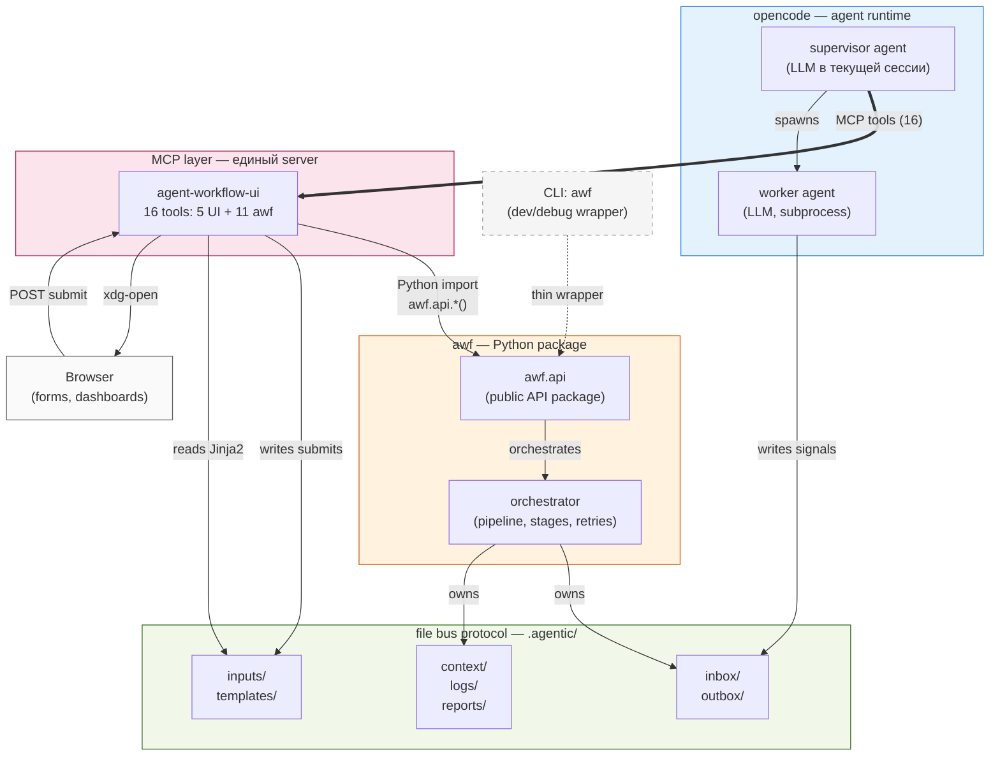

# agent-workflow-ui — Architecture

> Архитектурный документ для `agent-workflow-ui` — MCP plugin для opencode, который даёт агенту 16 typed MCP tools: 5 UI (HTML-формы для структурированного ввода) + 11 awf workflow operations (init, start, status, rollback, ...). Plugin зависит от `awf` Python-пакета и импортирует `awf.api` напрямую (без subprocess).

**Версия:** 1.2
**Дата:** 2026-08-01
**Pivot с v1.1:** объединены UI MCP + awf-mcp в один server (16 tools); plugin теперь depends on awf; CLI primary → MCP primary.
**Связанные документы:** [Product Vision](agent-ui-plugin.md) v0.5, [File Bus Protocol](../protocols/communication.md), [awf README](../README.md)

---

## 1. Overview

### 1.1 Что это

`agent-workflow-ui` — Python-пакет, реализованный как MCP server. Работает внутри opencode, даёт supervisor-агенту 16 typed MCP tools:

- **UI tools (5):** `open_form`, `read_submit`, `cancel_form`, `list_pending_forms`, `list_templates`. Генерация/чтение HTML-форм, открытие в браузере.
- **awf workflow tools (11):** `awf_init`, `awf_status`, `awf_start`, `awf_continue`, `awf_baseline`, `awf_rollback`, `awf_approve`, `awf_report`, `awf_reset`, `awf_add_role`, `awf_analyze_roles`. Полный lifecycle awf-проекта.

Все 11 workflow tools — thin async wrappers над `awf.api.*()` синхронными функциями. Business logic живёт в `awf.api`, не в plugin'е.

### 1.2 Для кого

- **Пользователь** (developer / PM): получает привычный визуальный интерфейс для сложных решений вместо длинных chat-ответов.
- **Агент** (supervisor LLM): typed MCP tools вместо bash-команд. Один plugin — все операции.
- **awf orchestrator:** управляется через `awf.api` (single source of truth для CLI и MCP).

### 1.3 Главные свойства

- **MCP primary path.** Agent вызывает typed MCP tools. CLI `awf` — dev/debug обёртка.
- **Plugin зависит от awf.** `pyproject.toml: dependencies += ["awf>=0.4.0"]`. Workflow tools импортируют `awf.api` напрямую.
- **UI tools agnostic** — только `inputs/` I/O, не знают про awf internals.
- **Submit'ы попадают в plugin автоматически** через локальный HTTP endpoint (стандартный HTML `<form method="POST">`).
- **Templates коммитятся в git** (часть дизайна проекта), submits — runtime state (gitignored).

---

## 2. Context

### 2.1 Где plugin живёт в ecosystem



### 2.2 Принципы интеграции

- **opencode runtime** — общий, не зависит от наших продуктов.
- **MCP layer — ОДИН server** (в v1.1 было два: UI + awf-mcp). Все 16 tools в одном plugin'е.
- **awf.api — single source of truth** для workflow logic. Plugin и CLI оба делегируют в него.
- **UI tools agnostic** (только `inputs/`), **workflow tools** — thin wrappers над `awf.api`.
- **File bus** — внутренний контракт awf. Plugin пишет напрямую только в `inputs/`.

---

## 3. Принципы и ограничения

### 3.1 Принципы

1. **MCP primary path, CLI supplement.** Agent вызывает typed MCP tools. CLI `awf` — dev/debug обёртка для CI/скриптов/тестов.
2. **Plugin зависит от awf.** `pyproject.toml: dependencies += ["awf>=0.4.0"]`. Workflow tools импортируют `awf.api` напрямую. UI tools остаются agnostic (только `inputs/` I/O).
3. **MCP как единственный interface для агента.** Агент вызывает plugin только через typed MCP tools. Никаких bash-команд или ручных file reads.
4. **Submit автоматический через HTTP.** Пользователь нажимает Submit → данные автоматически попадают в plugin через локальный HTTP endpoint. Стандартный HTML form POST.
5. **Templates — часть проекта.** Шаблоны форм живут в `.agentic/templates/` и коммитятся в git (как `pipelines/`). Submits — runtime state, gitignored.
6. **Single source of truth для workflow logic.** `awf.api` содержит всю business logic. CLI и MCP tools — оба тонкие обёртки. Поведение идентично, diverging semantics исключены.

### 3.2 Ограничения

| Ограничение | Обоснование |
|---|---|
| MCP transport: stdio | Стандарт для opencode local plugins. HTTP/remote — future. |
| Python ≥ 3.10 | Требование зависимости `mcp>=1.0`. Awf-core остаётся ≥3.9 (не зависит от mcp). |
| Single-user, single-session | Multi-user — far future. |
| Desktop browser только | Mobile/CLI-only — не target audience. |
| Runtime dependencies: PyYAML, Jinja2, mcp | Минимум для typed MCP server. |
| Browser open через `xdg-open`/`open` | Без native browser bindings. |

---

## 4. Components

### 4.1 Внутренняя структура plugin'а

```
agent_workflow_ui/
├── __init__.py
├── __main__.py                # entry: python -m agent_workflow_ui
├── server.py                  # MCP server (stdio transport), регистрирует 16 tools (5 UI + 11 awf)
├── http_endpoint.py           # localhost HTTP для приёма submits + save/delete custom roles
├── browser.py                 # xdg-open / open wrapper
├── config.py                  # env vars, paths (relative to cwd opencode = project root)
├── state.py                   # in-memory registry of open forms, form_id generation
├── opencode_config.py         # read opencode models (CLI + SQLite recent), scan/save/delete roles
├── skill_installer.py         # auto-install SKILL.md to ~/.config/opencode/skills/ on startup (lazy, idempotent)
├── tools/                     # MCP tool implementations
│   ├── forms.py               # UI tools: open_form, read_submit, cancel_form, list_pending_forms
│   ├── templates.py           # UI tool: list_templates
│   └── awf.py                 # awf workflow tools (11): awf_init, awf_status, awf_start, ...
│                              #   thin async wrappers over awf.api.*()
├── render/                    # Jinja2 rendering layer
│   ├── engine.py              # Environment setup, ChoiceLoader (project first → defaults)
│   ├── frontmatter.py         # YAML frontmatter parser
│   └── default_templates/     # templates shipped with plugin
│       ├── project-setup.html.j2       # ← MVP composite template (Сценарий 1)
│       ├── role-assignment.html.j2     # ← reserved for Сценарий 6 wizard
│       ├── skill-picker.html.j2        # ← reserved for Сценарий 6 wizard
│       ├── model-picker.html.j2        # ← reserved for Сценарий 6 wizard
│       ├── pipeline-picker.html.j2     # ← reserved (в MVP pipeline выводится supervisor'ом)
│       └── conflict-resolver.html.j2   # ← reserved for inline conflict (в MVP заменён на JS confirm)
├── pyproject.toml             # package metadata, dependencies += ["awf>=0.4.0"]
└── SKILL.md                   # policy для LLM (копируется в ~/.config/opencode/skills/agent-workflow-ui/)
```

### 4.2 Component responsibilities

| Компонент | Ответственность |
|---|---|
| `server.py` | MCP protocol handling, tool dispatch, lifecycle. Регистрирует **16 tools**: 5 UI (`open_form`, `read_submit`, `cancel_form`, `list_pending_forms`, `list_templates`) + 11 awf workflow (`awf_init`, `awf_status`, `awf_start`, `awf_continue`, `awf_baseline`, `awf_rollback`, `awf_approve`, `awf_report`, `awf_reset`, `awf_add_role`, `awf_analyze_roles`). Без `wait_for_submit` / `open_form_and_wait`. |
| `http_endpoint.py` | Localhost HTTP server, accepts `/submit/<form_id>` POSTs, writes YAML в `inputs/`, после submit: `_maybe_save_custom_roles()` и `_maybe_delete_custom_roles()` синхронизируют `~/.config/awf/roles/`. |
| `browser.py` | Cross-platform browser open (`xdg-open` Linux, `open` macOS, fallback error). |
| `config.py` | Reads env vars at startup, resolves paths. Defaults: `.agentic/inputs`, `.agentic/templates`, `.agentic/dashboards` (relative to cwd opencode). |
| `state.py` | In-memory registry: `{form_id, template, opened_at, status}`. **Form ID generator:** `FORM-YYYYMMDDHHMMSS-XXXX` (timestamp + 4 random alphanumeric). |
| `opencode_config.py` | `read_opencode_models()` (через `opencode models` CLI), `read_recent_models()` (SQLite history), `scan_global_roles()` / `save_custom_role()` / `delete_custom_role()` для `~/.config/awf/roles/`. |
| `skill_installer.py` | `ensure_skill_installed()` — вызывается из `__main__.py` при каждом старте. Idempotent: копирует bundled SKILL.md в `~/.config/opencode/skills/agent-workflow-ui/` если отсутствует или содержимое устарело. Заменяет хрупкие setuptools post-install hooks для user-locale paths. |
| `tools/forms.py` | UI tools: `open_form`, `read_submit`, `cancel_form`, `list_pending_forms`. `open_form` scans global roles и injects `custom_supervisor_roles`, `custom_agents` в template context. |
| `tools/templates.py` | UI tool: `list_templates`. Сканирует defaults (в пакете) + project-level (`.agentic/templates/`) если есть. |
| `tools/awf.py` | **awf workflow tools (11)** — thin async wrappers над `awf.api.*()`. Каждый tool: try/except `AwfApiError` → returns `{status: "ok"|"error", ...}`. Не содержит business logic (всё в `awf.api`). |
| `render/engine.py` | Jinja2 environment с `ChoiceLoader`: project templates first, defaults second. Strips frontmatter из output. |
| `render/frontmatter.py` | Parses YAML frontmatter at top of `.html.j2` files. |
| `render/default_templates/` | Templates shipped with plugin. **MVP primary: `project-setup.html.j2`** (composite). Остальные — reserved для будущих сценариев. |

### 4.3 Lifecycle

Plugin запускается opencode как subprocess при старте сессии:

1. opencode spawns `python -m agent_workflow_ui`.
2. Plugin reads env vars (`AWF_INPUTS_DIR`, `AWF_TEMPLATES_DIR`, `AWF_HTTP_PORT`, ...).
3. Plugin создаёт директории если отсутствуют.
4. Plugin запускает HTTP endpoint на `127.0.0.1:AWF_HTTP_PORT` (default: auto-select free port).
5. Plugin регистрирует MCP tools через stdio protocol.
6. Живая, пока жива opencode сессия.
7. При shutdown — cleanup временных HTML файлов в temp dir.

---

## 5. Form lifecycle

### 5.1 Полный flow (на примере)

Сценарий: пользователь начинает новый проект. Supervisor открывает composite-форму настройки.

1. **Пользователь** в CLI: «хочу настроить проект».
2. **Агент** вызывает `open_form(template="project-setup", data={available_roles: [...]})`. Plugin автоматически injects `available_models`, `recent_models` (из Jinja2 globals), `custom_supervisor_roles`, `custom_agents` (из `scan_global_roles()`).
3. **Plugin:**
   - Генерирует `form_id` (`FORM-20260726143022-a1b2`).
   - Рендерит Jinja2, inject'ит `submit_url=http://127.0.0.1:PORT/submit/FORM-...`.
   - Сохраняет HTML во временный файл, открывает browser.
   - Возвращает: `{form_id, browser_opened: true, submit_url}`.
4. **Агент** в CLI: «Я открыл форму. Заполни и нажми Submit, потом скажи здесь».
5. **Пользователь** заполняет composite-форму: контекст, supervisor, команда агентов (выбор/inline custom + модель), при необходимости удаляет сохранённые роли через 🗑. Нажимает Submit.
6. **Browser** отправляет `<form method="POST">` на `/submit/FORM-...`.
7. **HTTP endpoint:**
   - Парсит form-urlencoded body.
   - Пишет YAML в `inputs/FORM-....yaml`.
   - Вызывает `_maybe_save_custom_roles()` (если были галочки 💾) и `_maybe_delete_custom_roles()` (если были 🗑).
   - Возвращает HTML ack page.
8. **Агент** получает от пользователя «done» → `read_submit(form_id)` → `{submitted: true, data: {...}}`.
9. **Агент** анализирует `data` (включая `team_config` JSON, `spec_files_json` JSON) и **сам** генерирует `.agentic/config.yaml`, `roles/`, `pipelines/`, `.gitignore`. Plugin этого не делает — он agnostic.

### 5.2 Failure modes

| Ситуация | Поведение |
|---|---|
| Browser не открылся | `open_form` возвращает `{browser_opened: false, error: "..."}`. Агент сообщает пользователю. |
| Submit неполный (required fields пустые) | HTML5 form validation (`required`) блокирует submit в browser. Пользователь видит стандартное сообщение. |
| Submit semantic invalid (валидный YAML, но неверный выбор) | Агент получает данные через `read_submit`, валидирует semantic на LLM-side. При ошибке открывает новую форму с pre-filled данными и комментарием. |
| Submit не пришёл | `read_submit` возвращает `{submitted: false, status: "pending"}`. Агент может подождать, отменить через `cancel_form`, или продолжить другую работу. |
| Duplicate submit | Plugin идемпотентен по `form_id`. Повторные POST на `/submit/FORM-...` игнорируются после первого. |
| Concurrent `open_form` | Каждый вызов создаёт новый `form_id`. Старый остаётся pending. |
| Agent перезапустился между `open_form` и `read_submit` | Form ID — это имя файла в `.agentic/inputs/`. Новый агент вызывает `read_submit(form_id)` и читает файл. Stateless recovery. |

---

## 6. MCP Tools (Reference)

### 6.1 `open_form`

Открыть HTML форму в браузере пользователя.

**Аргументы:**

| Имя | Тип | Required | Описание |
|---|---|---|---|
| `template` | string | yes | Имя template (без расширения, например `"role-assignment"`). |
| `data` | object | no | Переменные для рендеринга. |
| `ttl_seconds` | int | no | Авто-отмена через N секунд. Default: без TTL. |

**Возвращает:**

```json
{
  "form_id": "FORM-20260726143022-a1b2",
  "browser_opened": true,
  "submit_url": "http://127.0.0.1:13747/submit/FORM-20260726143022-a1b2",
  "expires_at": null
}
```

**При ошибке:**

```json
{
  "form_id": "FORM-20260726143022-c3d4",
  "browser_opened": false,
  "error": "Browser open failed: xdg-open exit code 1"
}
```

**Внутри:**
1. Сгенерировать form_id (timestamp + random suffix, формат см. §7.4).
2. Найти template: `.agentic/templates/<name>.html.j2` (project override) → `render/default_templates/<name>.html.j2` (default).
3. Рендерить Jinja2 с переменными `form_id`, `submit_url`, `template_name` + ключи из `data`.
4. Сохранить HTML во временный файл (`/tmp/agent-workflow-ui-<form_id>.html`).
5. Запустить `xdg-open`/`open`.
6. Записать в registry: `{form_id, template, opened_at, status: "pending"}`.

---

### 6.2 `read_submit`

Проверить, заполнил ли пользователь форму, и если да — вернуть данные.

**Аргументы:**

| Имя | Тип | Required | Описание |
|---|---|---|---|
| `form_id` | string | yes | ID формы, открытой через `open_form`. |

**Возвращает (форма pending):**

```json
{
  "submitted": false,
  "form_id": "FORM-20260726143022-a1b2",
  "status": "pending",
  "opened_at": "2026-07-26T14:30:22Z"
}
```

**Возвращает (форма submitted):**

```json
{
  "submitted": true,
  "form_id": "FORM-20260726143022-a1b2",
  "status": "submitted",
  "submitted_at": "2026-07-26T14:31:45Z",
  "template": "project-setup",
  "data": {
    "context_message": "...",
    "team_config": "[...]",
    "spec_files_json": "..."
  }
}
```

**Возвращает (форма cancelled/expired):**

```json
{
  "submitted": false,
  "form_id": "FORM-20260726143022-a1b2",
  "status": "cancelled",
  "opened_at": "2026-07-26T14:30:22Z"
}
```

> **Note:** `read_submit` возвращает `status` и `opened_at` для всех не-submitted состояний. `cancelled_at`/`expires_at` доступны в in-memory `FormRecord`, но не включены в response — статус сигнализирует о состоянии формы.

**Поведение:**
- Idempotent —多次ые вызовы возвращают тот же результат.
- Не блокирует агент.

---

### 6.3 `cancel_form`

Отменить форму. Submit'ы для отменённой формы игнорируются.

**Аргументы:**

| Имя | Тип | Required | Описание |
|---|---|---|---|
| `form_id` | string | yes | ID формы. |

**Возвращает:**

```json
{ "cancelled": true, "form_id": "FORM-20260726143022-a1b2" }
```

**При попытке отменить уже submitted:**

```json
{ "cancelled": false, "form_id": "FORM-20260726143022-a1b2", "reason": "already_submitted" }
```

---

### 6.4 `list_pending_forms`

Возвращает формы, открытые и ещё не submitted/cancelled.

**Аргументы:** нет.

**Возвращает:**

```json
{
  "pending": [
    {
      "form_id": "FORM-20260726143022-a1b2",
      "template": "project-setup",
      "opened_at": "2026-07-25T14:30:22Z",
      "age_seconds": 45
    }
  ],
  "count": 1
}
```

---

### 6.5 `list_templates`

Возвращает все доступные templates — default (из plugin'а) и project-level (из `.agentic/templates/`).

**Аргументы:** нет.

**Возвращает:**

```json
{
  "templates": [
    {
      "name": "role-assignment",
      "source": "default",
      "description": "Multi-select ролей для проекта",
      "required_data_keys": ["available_roles"],
      "optional_data_keys": ["default_selection", "project_name"]
    },
    {
      "name": "stack-picker",
      "source": "project",
      "description": "Custom stack template for this project",
      "required_data_keys": ["project_type"],
      "optional_data_keys": []
    }
  ]
}
```

**Project templates override defaults по имени.** Если в `.agentic/templates/role-assignment.html.j2` есть файл — он используется вместо default.

---

## 7. File bus contract

### 7.1 Directory extensions to `.agentic/`

| Directory | Назначение | Gitignored? | Naming |
|---|---|---|---|
| `.agentic/inputs/` | Submit файлы (от browser к агенту). Per-project. | yes | `<form_id>.yaml` |
| `.agentic/templates/` | Project-level Jinja2 templates. **Agent-driven** — пользователь не кладёт файлы вручную, только агент (LLM) создаёт front+back. | no (committed) | `<name>.html.j2` |
| `.agentic/dashboards/` | Rendered dashboards (transient, future scope) | yes | `<name>.html` |

**Вне `.agentic/` (глобально, `~/.config/awf/`):**

| Path | Назначение | Содержимое |
|---|---|---|
| `~/.config/awf/roles/` | Библиотека кастомных ролей (supervisor variants + custom agents). | `<slug>.md` для agents, `supervisor-<slug>.md` для supervisor variants. |
| `~/.config/awf/inputs/` | Fallback если `.agentic/inputs/` недоступен (не используется в normal flow). | — |

**Почему роли глобальные, а не per-project:** кастомные роли — переиспользуемый актив пользователя. Создал `ml-engineer.md` в одном проекте → доступен во всех. Это согласовано с UX формой: dropdown «Мои агенты» и «Supervisor variants» показывает глобальные saved roles.

### 7.2 Submit file format

**Path:** `.agentic/inputs/<form_id>.yaml`

```yaml
form_id: FORM-20260726143022-a1b2
template: project-setup
submitted_at: 2026-07-26T14:31:45Z
data:
  # Структура зависит от template. Пример для composite project-setup:
  context_message: "Интернет-магазин на FastAPI..."
  spec_files_json: '[{"filename":"tz.md","content":"..."}]'   # JSON-строка, агент парсит сам
  supervisor_role: ""                                          # "" = default, "supervisor-architect" = saved, "__custom__" = uploaded
  supervisor_content: "..."                                    # только если __custom__
  save_supervisor: "true"                                      # только если галочка
  team_config: '[{"type":"default","agent":"backend-dev","model":"anthropic/claude-3.5"},{"type":"custom","agent":"ml-augmentor","skill_content":"...","model":"...","save":true}]'
  delete_agent: "old-role,another-role"                        # comma-separated id удалённых ролей
```

**Schema:**
- `form_id` (string, required) — совпадает с именем файла без `.yaml`.
- `template` (string, required) — какой template использовался.
- `submitted_at` (ISO 8601 UTC, required) — когда пользователь нажал Submit.
- `data` (object, required) — payload из формы. Структура определяется HTML form fields.
  - **JSON-строки** (`team_config`, `spec_files_json`) — backend сохраняет как есть, парсинг — ответственность LLM. Это позволяет backend'у оставаться agnostic к структуре team/spec.
  - **Исключение:** `team_config` парсится backend'ом **один раз** в `_maybe_save_custom_roles()` чтобы найти custom agents с `save=true`. Это не нарушает agnostic принцип — backend читает только служебные поля, не интерпретирует содержимое.

### 7.3 Template file format

**Path:** `.agentic/templates/<name>.html.j2` (project) или `render/default_templates/<name>.html.j2` (default).

**Структура:** YAML frontmatter + Jinja2 template.

```jinja2
---
description: Выбор ролей для проекта
required_data_keys:
  - available_roles
optional_data_keys:
  - default_selection
  - project_name
---
<!DOCTYPE html>
<html lang="ru">
<head>
  <meta charset="UTF-8">
  <title>Выбор ролей — {{ project_name | default("проект") }}</title>
  <style>
    body { font-family: system-ui, sans-serif; max-width: 600px; margin: 40px auto; padding: 0 20px; }
    label { display: block; padding: 8px 0; }
    .actions { margin-top: 24px; }
    button { padding: 8px 24px; font-size: 16px; }
  </style>
</head>
<body>
  <h1>Выберите роли для проекта «{{ project_name | default("без названия") }}»</h1>

  <form action="{{ submit_url }}" method="POST">
    <fieldset>
      <legend>Роли</legend>
      
      <label>
        <input type="checkbox" name="selected_roles" value="{{ role }}"
          checked>
        {{ role }}
      </label>
      
    </fieldset>

    <input type="hidden" name="project_name" value="{{ project_name | default('') }}">

    <div class="actions">
      <button type="submit">Submit</button>
    </div>
  </form>
</body>
</html>
```

**Plugin-injected variables (доступны всем templates):**
- `{{ form_id }}` — ID текущей формы.
- `{{ submit_url }}` — URL для `<form action="...">`.
- `{{ template_name }}` — имя текущего template.

**Agent-supplied variables:** любые ключи из `data` параметра `open_form`.

### 7.4 Form ID format

`FORM-YYYYMMDDHHMMSS-XXXX`, где:
- `YYYYMMDDHHMMSS` — UTC timestamp в момент `open_form` (readable, человеко-читаемый).
- `XXXX` — 4 случайных alphanumeric-символа (`[a-z0-9]`) — гарантирует уникальность при нескольких формах в одну секунду и **защищает от коллизий со stale-файлами** в `.agentic/inputs/` от прошлых сессий.

Пример: `FORM-20260726143022-a1b2`.

**Реализация:** `state.py:FormRegistry.next_form_id()` использует `time.strftime` + `random.choices(string.ascii_lowercase + string.digits, k=4)`.

**Почему не sequence (`FORM-001`)?** Sequence-based IDs вызывают коллизию: новая сессия начинает счёт с 1 → submit'ит в файл `FORM-001.yaml`, который уже существует от прошлой сессии → stale data. Timestamp + random suffix этой проблемы лишён.

**Коллизии:** практически невозможны. Вероятность повтора 4-char suffix в ту же секунду ≈ 1 / 1.6M.

---

## 8. Configuration

### 8.1 Environment variables

Передаются opencode при spawn subprocess:

| Env var | Default | Описание |
|---|---|---|
| `AWF_INPUTS_DIR` | `.agentic/inputs` | Куда пишутся submits (relative to cwd opencode = project root). Per-project. |
| `AWF_TEMPLATES_DIR` | `.agentic/templates` | Project-level templates (**agent-driven** — пользователь не кладёт файлы вручную). |
| `AWF_DASHBOARDS_DIR` | `.agentic/dashboards` | Rendered dashboards (future scope). |
| `AWF_HTTP_PORT` | `0` (auto-select) | Порт HTTP endpoint. `0` = автоматически выбрать свободный. |
| `AWF_OPEN_BROWSER_CMD` | `auto` | `xdg-open` / `open` / `auto` (detect platform). |
| `AWF_TEMP_DIR` | `/tmp` | Куда писать временные HTML файлы. |
| `AWF_DEFAULT_TTL_SECONDS` | `86400` (24h) | Default TTL для forms без явного `ttl_seconds`. |

### 8.2 opencode.json integration

```json
{
  "mcp": {
    "agent-workflow-ui": {
      "type": "local",
      "command": ["python3", "-m", "agent_workflow_ui"],
      "environment": {
        "AWF_INPUTS_DIR": ".agentic/inputs",
        "AWF_TEMPLATES_DIR": ".agentic/templates"
      }
    }
  }
}
```

При установке plugin'а пользователь добавляет этот блок в `~/.config/opencode/opencode.json`. После этого plugin автоматически запускается при старте opencode сессии.

В будущем — `awf init` может предлагать добавить эту конфигурацию автоматически.

### 8.3 HTTP endpoint

- **Bind:** `127.0.0.1` только. Не доступен снаружи.
- **Port:** `AWF_HTTP_PORT` или auto-select.
- **Endpoints:**
  - `POST /submit/<form_id>` — принять submit. Body: form-encoded HTML form data (стандартный `<form method="POST">`).
  - `GET /health` — health check.
- **Limits:**
  - Max body size: 1MB.
  - `form_id` валидируется на соответствие открытой форме.
  - Прочие paths отбрасываются.

---

## 9. SKILL — policy for LLM

Skill markdown (`SKILL.md`) — инструкция для LLM, когда и как использовать формы.

**Установка:** **lazy install при каждом старте plugin'а** (через `skill_installer.py`). При запуске `python -m agent_workflow_ui` plugin проверяет bundled `SKILL.md` и копирует его в `~/.config/opencode/skills/agent-workflow-ui/SKILL.md`, если файла нет или содержимое устарело. Это **заменило** изначально запланированный setuptools post-install hook — последний оказался ненадёжным для user-locale paths (`~/.config/`).

Преимущества lazy install:
- **Self-healing:** `pip install --upgrade` обновляет SKILL.md автоматически при следующем старте opencode.
- **Idempotent:** проверяет содержимое файла, не timestamp — копирует только если bundled отличается.
- **Не зависит от setuptools internals:** работает в virtualenv, pip cache, editable installs.
- **End-user experience:** после `pip install agent-workflow-ui` plugin готов к работе. Никаких ручных шагов.

Реализация: `agent_workflow_ui/skill_installer.py:ensure_skill_installed()` — вызывается из `__main__.py` при каждом старте.

```markdown
# Agent Workflow UI

Plugin for opencode that gives agent tools for visual interaction with users:
HTML forms for structured input, dashboards for monitoring. Use forms when chat
is inefficient — they are a supplement to chat, not a replacement.

## When to use a form

Call `open_form` when:
- **Setting up a new project** with full configuration (→ `project-setup` composite template — MVP primary).
- Selecting roles/skills/models for a project (→ reserved templates для будущих wizard).
- A **file upload** is needed (ТЗ, product-vision, custom role .md).
- Need to choose from 4+ options with descriptions.
- Prioritizing 10+ items (→ `priority-matrix`, future).
- Long-running pipeline monitoring (→ dashboard, future).

## When NOT to use a form (use chat instead)

- Y/N answer.
- Choice between 2-3 short options.
- Clarifying questions during work.
- Tone calibration, approach discussion.

## Pattern использования — NON-BLOCKING

**Always use `open_form` (non-blocking). Never use `open_form_and_wait`.**

1. Agent decides a form is needed.
2. Call `open_form(template="...", data={...})` — opens form, returns `form_id` immediately.
3. Tell the user in CLI: «I opened a form in your browser. Fill it out, click Submit, then tell me here when you're done.»
4. Agent is now free — can continue other work or wait.
5. When the user types something in CLI (e.g., "done"):
   - Call `read_submit(form_id)` to retrieve the submitted data.
   - Analyze `data` and proceed.

**Critical:** You MUST tell the user to come back to CLI and notify you after submitting.

## Available templates

Call `list_templates` to see what's available. Primary (MVP):
- `project-setup` — composite form: context + supervisor + team + models. Models pulled from opencode config automatically.

Reserved for future scenarios:
- `role-assignment`, `skill-picker`, `model-picker`, `pipeline-picker`, `conflict-resolver`.

Project-level templates in `.agentic/templates/` override defaults by name. **Только агент может создавать templates** (пишет front + описывает back в supervisor.md).

## Mistakes to avoid

- DO NOT use `open_form_and_wait` — it blocks the agent.
- DO NOT forget to tell the user to come back to CLI after submitting.
- DO NOT open a form for Y/N questions — use chat.
- DO NOT open more than 3 forms simultaneously — the user will be confused.
- DO NOT use forms as a chat replacement — they're a supplement.
```

---

## 10. Testing

### 10.1 Unit tests (`tests/agent_workflow_ui/`)

| File | Что тестирует |
|---|---|
| `test_render.py` | Jinja2 rendering с разными data, валидность HTML, contains `submit_url`. |
| `test_forms.py` | Tool logic: `open_form` генерирует form_id, `read_submit` читает файлы, `cancel_form` помечает. |
| `test_browser.py` | Mock subprocess для `xdg-open`/`open`, fallback error handling. |
| `test_http_endpoint.py` | POST на `/submit/<form_id>` → файл пишется, duplicate handling, max body size. |
| `test_templates.py` | Default templates render без errors с minimum required data. |
| `test_frontmatter.py` | YAML frontmatter parsing, malformed frontmatter errors. |

Fixtures: `tmp_path` для изоляции. Не трогают реальную filesystem.

### 10.2 Integration tests (`tests/integration/`)

| File | Что тестирует |
|---|---|
| `test_form_lifecycle.py` | Full lifecycle: spawn MCP server как subprocess, имитировать tool calls через stdio, проверять responses. |
| `test_submit_via_http.py` | MCP server запущен, реальный HTTP POST через `requests`, проверить файл в `inputs/`. |

### 10.3 E2E tests (future)

С реальным browser через `playwright`. Не в MVP.

### 10.4 Coverage target

≥80% на `agent_workflow_ui/`. Awf coverage не меняется (plugin — отдельный package).

---

## 11. Migration path

### 11.1 Для существующих пользователей awf

- **Awf core** — ничего не меняется. CLI работает как прежде.
- **`awf init`** — получит опциональный prompt: «Установить agent-workflow-ui plugin? [y/N]». Если yes — добавляет конфиг в `~/.config/opencode/opencode.json`.
- **Существующие `.agentic/` структуры** — обратная совместимость. Папки `inputs/`, `templates/` создаются при первом `open_form`, не при `awf init`.

### 11.2 Изменения в `.gitignore`

Добавляются строки:
```
.agentic/inputs/
.agentic/dashboards/
```

### 11.3 Установка plugin (для новых пользователей)

```bash
pip install agent-workflow-ui
```

После установки:
- **SKILL.md автоматически копируется** в `~/.config/opencode/skills/agent-workflow-ui/SKILL.md` через **lazy install** при первом старте plugin'а (см. `skill_installer.py`). Дополнительных ручных шагов нет.
- MCP-конфиг в `~/.config/opencode/opencode.json` пользователь добавляет один раз (или через `awf init` — см. §11.1).

Принцип: **после `pip install` plugin полностью готов к работе** — никаких костылей, ручных копирований, активаций. Это сознательное решение для end-user experience.

> **Note:** изначально планировался setuptools post-install hook, но он оказался ненадёжным для user-locale paths (`~/.config/`). Заменён на lazy install при каждом старте plugin'а.

---

## 12. Scope

### 12.1 В MVP (Сценарий 1 — Конструктор конфигурации)

✅ Включено:
- MCP server с 5 tools (`open_form`, `read_submit`, `cancel_form`, `list_pending_forms`, `list_templates`).
- **HTTP endpoint всегда включён** (единственный способ принять submit из браузера).
- Jinja2 rendering с ChoiceLoader (project → defaults).
- **1 primary composite template:** `project-setup.html.j2` (context + supervisor + team + models + spec files).
- **5 reserved templates** для будущих сценариев: `role-assignment`, `skill-picker`, `model-picker`, `pipeline-picker`, `conflict-resolver`. Не используются как primary interface в MVP.
- Browser open через `xdg-open`/`open`.
- File bus: `.agentic/inputs/`, `.agentic/templates/` (project), `~/.config/awf/roles/` (global custom roles).
- **Custom roles persistence**: save/delete через `_maybe_save_custom_roles` / `_maybe_delete_custom_roles` в HTTP endpoint.
- **Inline conflict resolution** через JS `confirm()` перед перезаписью существующей роли.
- **Models auto-discovery**: `opencode models` CLI + recent models из SQLite.
- **Lazy skill install** при каждом старте plugin'а (через `skill_installer.py`) — автоматически копирует `SKILL.md` в opencode skills dir.

❌ НЕ включено:
- Dashboards (Сценарий 4 — later).
- Decision-tree forms в runtime (Сценарий 2 — later).
- Pipeline-declared forms через `action: request_input` (future).
- `awf-mcp` separate MCP server (future).
- HTTP remote transport (future).
- Real-time updates via SSE/WebSocket (far future).
- Multi-user (far future).

### 12.2 После MVP — по приоритету сценариев

| Сценарий | Что добавляет |
|---|---|
| 2 (Decision fork) | Runtime ad-hoc forms (в любом месте pipeline). |
| 3 (Blockage recovery) | Шаблон `blockage-recovery.html.j2`, multi-step flow. |
| 4 (Monitoring) | Dashboard rendering, `dashboard.html.j2`, meta-refresh. |
| 5 (Priority planning) | Drag-and-drop UI (сложнее, новый тип template). |
| 6 (Onboarding wizard) | Multi-form state, conditional logic между формами. |

---

## 13. Decision log

Принципиальные архитектурные решения с обоснованием (без history of consideration — только final rationale).

| Решение | Обоснование |
|---|---|
| MCP transport: stdio | Стандарт для opencode local plugins (codebase-memory-mcp pattern). HTTP/remote — future. |
| HTTP endpoint для submits (всегда включён) | Smooth UX: пользователь нажимает Submit → данные автоматически попадают в plugin. Никаких ручных скачиваний файла. |
| Form ID = timestamp + random suffix (`FORM-YYYYMMDDHHMMSS-XXXX`) | Sequence-based (`FORM-001`) вызывал коллизии со stale-файлами прошлых сессий. Timestamp + 4-char random — практически impossible collision + human-readable. |
| MCP SDK = official `mcp` package (требует Python ≥3.10) | Не пишем свою реализацию JSON-RPC. Стандарт, как `requests` для HTTP. |
| Нативный HTML `<form method="POST">` | Browser сам отправляет данные. Никакого JS injection, никаких YAML serializers в JavaScript. |
| Jinja2 templates | Стандарт Python-шаблонизатор (Flask, Django, Ansible). Простой синтаксис, мощные возможности. |
| **Composite template `project-setup`** вместо 5 отдельных | Меньше кликов, нагляднее. Все секции (context + supervisor + team + models) на одной странице. Pipeline НЕ выбирается явно — выводится supervisor'ом. |
| **Inline conflict resolution** через JS `confirm()` | Не требует отдельной follow-up мини-формы (как планировалось в vision v0.3). Быстрее, проще UX. |
| **Agent-driven project templates** | `.agentic/templates/` override только через агента (front+back). Пользователь не кладёт файлы вручную — избегаем «битых» templates. |
| **Custom roles в `~/.config/awf/roles/`** (глобально, не per-project) | Кастомные роли — переиспользуемый актив. Создал в одном проекте → доступен во всех. |
| **Lazy skill install** (через `skill_installer.py`) | End-user principle: после `pip install` plugin готов к работе при первом старте opencode. Заменяет ненадёжные setuptools post-install hooks для user-locale paths. |
| Templates коммитятся в git (`.agentic/templates/`) | Часть дизайна проекта, как `pipelines/`. Submits — runtime state, gitignored. |
| Browser open через `xdg-open`/`open` | Без native browser bindings. Используем браузер по умолчанию пользователя. |
| `awf-mcp` отдельный от `agent-workflow-ui` | Clean separation: UI layer agnostic, awf layer specific. Plugin reusable с другими orchestrators. |
| Standalone package на PyPI | Не быть заложником текущей версии awf. Plugin работает с любым orchestrator'ом, реализующим file bus. |
| Pipeline-declared forms отложены | MVP (Сценарий 1) — setup wizard, не pipeline stage. Pipeline-declared — future, когда runtime scenarios (2-5). |

---

## 14. Open questions

Вопросы из §14 v1.0 — статус после реализации MVP:

| # | Вопрос | Статус |
|---|---|---|
| 1 | MCP SDK конкретная версия | ✅ Закрыто: `mcp>=1.0`, требует Python ≥3.10. |
| 2 | HTTP port auto-selection | ✅ Закрыто: bind на port 0, `socket.getsockname()` для actual port. |
| 3 | In-memory state vs stateless | ✅ Закрыто: in-memory registry (`state.py`) + filesystem как source of truth. |
| 4 | Form ID counter storage | ✅ Закрыто: не нужен. Timestamp + random suffix, нет counter file. |
| 5 | Template frontmatter parser | ✅ Закрыто: `render/frontmatter.py` + PyYAML. |
| 6 | HTML escaping | ✅ Закрыто: Jinja2 autoescape включён. |
| 7 | Error response shape | ✅ Закрыто: dict с `error` key, HTTP status codes для browser. |
| 8 | Submit acknowledgement page | ✅ Закрыто: `_ack_page()` в `http_endpoint.py` — HTML страница «Submitted!» с инструкцией «вернуться в CLI». |

**Новые open questions** (после MVP):

1. **Spec files в YAML vs отдельные файлы** — сейчас spec files embedded в `spec_files_json` (строка в YAML). Для больших ТЗ это раздувает submit file. Возможно стоит писать в `~/.config/awf/specs/` отдельно и в YAML только paths.
2. **Skill picker vs merged concept** — сейчас custom agent = name + skill .md (merged). `skill-picker` template зарезервирован, но может оказаться unused, если merged concept победит.
3. **Expired forms принимают submit** — `do_POST` проверяет только `submitted` и `cancelled`. Expired-формы принимают submit (мягкий TTL). Фиксить или оставить как feature?

---

## 15. BD-10 · Skills normalization layer

When a pipeline has 2+ roles, global skills (`~/.config/opencode/skills/`) are
written generically and don't know about each other. The **skill normalization
layer** runs automatically before agent stages to resolve conflicts.

**Two-layer model:** global skills are read-only reference; supervisor generates
per-project local skills (`.agentic/skills/<role>.md`) that adapt each global
skill to the specific team composition, assigning zones of responsibility and
output contracts.

**Conflict resolution:** pipeline order = priority. First role wins; losers get
explicit prohibitions. Unresolved conflicts go to `plan.md` "Open questions".

**Triggers:** `project-setup` submit → `.agentic/state/needs_normalize.yaml` → next
`awf start` runs `normalize_skills` stage. Manual: `awf normalize`.

See [`protocols/communication.md`](../protocols/communication.md) §8 for full spec
and [`templates/roles/supervisor.md`](../templates/roles/supervisor.md) §8 for
supervisor instructions.

---

## 16. Glossary

| Термин | Определение |
|---|---|
| **MCP** | Model Context Protocol — стандарт от Anthropic для связи LLM-агентов с инструментами. |
| **MCP server** | Процесс, реализующий MCP protocol и предоставляющий tools/resources агентам. |
| **MCP tool** | Типизированная функция, доступная агенту через MCP. |
| **Plugin** | В контексте этого документа — `agent-workflow-ui` package. |
| **Opencode** | Agent runtime, в котором работают supervisor и worker. |
| **Supervisor** | Агент (LLM), работающий в текущей opencode сессии, планирует и верифицирует. |
| **Worker** | Агент (LLM), spawn'имый supervisor'ом через `opencode run`. |
| **Orchestrator** | Система, координирующая pipeline agentic работы. Awf — default. |
| **File bus** | Контракт взаимодействия между агентами и orchestrator'ом через файлы в `.agentic/`. |
| **Form** | HTML страница с полями для структурированного ввода пользователя. |
| **Submit** | Действие пользователя (нажатие кнопки Submit в форме), инициирующее POST на HTTP endpoint. |
| **Template** | Jinja2 файл (`.html.j2`) с YAML frontmatter, описывает структуру формы. |

---

## 16. Related documents

- [`vision/agent-ui-plugin.md`](agent-ui-plugin.md) — Product Vision (что и зачем).
- [`protocols/communication.md`](../protocols/communication.md) — File bus protocol spec (будет обновлён с `.agentic/inputs/` и `.agentic/templates/` секциями после реализации plugin'а).
- [`README.md`](../README.md) — awf README.
- [`BACKLOG.md`](../BACKLOG.md) — план развития (будет переписан под standalone framing).
- [MCP specification](https://modelcontextprotocol.io/) — Model Context Protocol documentation.
- [Anthropic MCP Python SDK](https://github.com/modelcontextprotocol/python-sdk) — reference implementation.
